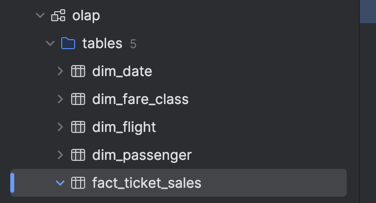
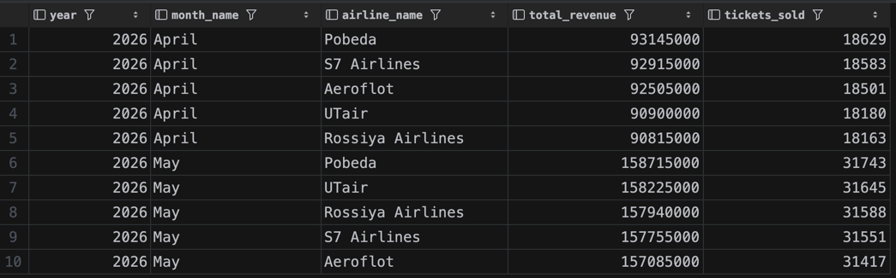
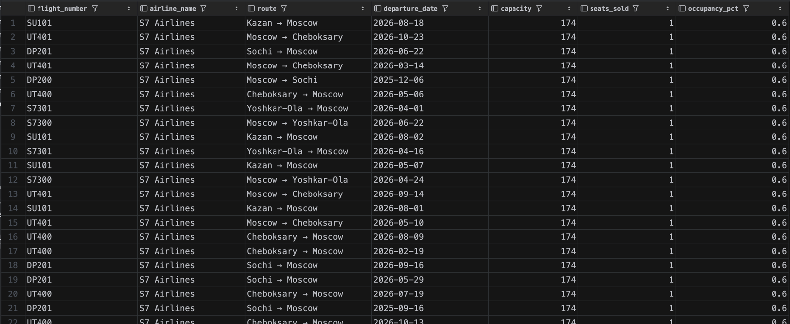
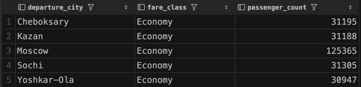

# Аналитические запросы

1. **Выручка по авиакомпаниям за месяц** — суммарная стоимость проданных билетов
2. **Загрузка рейсов** — процент заполненных мест относительно вместимости самолёта по каждому рейсу
3. **Количество пассажиров по классам обслуживания и городам вылета** — распределение пассажиров по классам (Economy/Business/First) с разбивкой по городу отправления

---

# Факт и зерно

**Главный факт**: продажа билета
**Зерно факта**: одна строка = один билет

Меры факта:
- `price` — стоимость билета

---

# Измерения

### dim_date
Атрибуты: год, квартал, месяц, день, день недели, признак выходного

### dim_flight
Рейс. Одна строка = один рейс
Атрибуты: номер рейса, авиакомпания, аэропорт вылета/прилёта, город вылета/прилёта, модель самолёта, вместимость

### dim_passenger
Пассажир. Одна строка = один пассажир
Атрибуты: имя, фамилия, дата рождения, серия и номер паспорта

### dim_fare_class
Класс обслуживания. Одна строка = один класс
Атрибуты: описание (Economy / Business / First).

---

# DDL и заполнение OLAP из OLTP

```sql
CREATE SCHEMA IF NOT EXISTS olap;

--Измерения

CREATE TABLE olap.dim_date (
    date_id     DATE PRIMARY KEY,
    year        SMALLINT NOT NULL,
    quarter     SMALLINT NOT NULL,
    month       SMALLINT NOT NULL,
    month_name  VARCHAR(20) NOT NULL,
    day         SMALLINT NOT NULL,
    day_of_week VARCHAR(10) NOT NULL,
    is_weekend  BOOLEAN NOT NULL
);

CREATE TABLE olap.dim_flight (
    flight_key       SERIAL PRIMARY KEY,
    flight_id        INT NOT NULL,
    flight_number    VARCHAR(8) NOT NULL,
    airline_name     VARCHAR(100) NOT NULL,
    departure_airport VARCHAR(3) NOT NULL,
    arrival_airport   VARCHAR(3) NOT NULL,
    departure_city   VARCHAR(100) NOT NULL,
    arrival_city     VARCHAR(100) NOT NULL,
    aircraft_model   VARCHAR(50) NOT NULL,
    capacity         SMALLINT NOT NULL
);

CREATE TABLE olap.dim_passenger (
    passenger_key   SERIAL PRIMARY KEY,
    passenger_id    INT NOT NULL,
    first_name      VARCHAR(100) NOT NULL,
    last_name       VARCHAR(100) NOT NULL,
    birthdate       DATE NOT NULL,
    passport_series CHAR(4) NOT NULL,
    passport_number CHAR(6) NOT NULL
);

CREATE TABLE olap.dim_fare_class (
    fare_class_key SERIAL PRIMARY KEY,
    fare_class_id  INT NOT NULL,
    description    VARCHAR(50) NOT NULL
);

-- Таблица фактов

CREATE TABLE olap.fact_ticket_sales (
    ticket_id         INT NOT NULL,
    booking_date_id   DATE NOT NULL REFERENCES olap.dim_date(date_id),
    departure_date_id DATE NOT NULL REFERENCES olap.dim_date(date_id),
    flight_key        INT NOT NULL REFERENCES olap.dim_flight(flight_key),
    passenger_key     INT NOT NULL REFERENCES olap.dim_passenger(passenger_key),
    fare_class_key    INT NOT NULL REFERENCES olap.dim_fare_class(fare_class_key),
    price             INT NOT NULL
);

-- Заполнение измерений

INSERT INTO olap.dim_date (date_id, year, quarter, month, month_name, day, day_of_week, is_weekend)
SELECT DISTINCT
    d::DATE,
    EXTRACT(YEAR FROM d)::SMALLINT,
    EXTRACT(QUARTER FROM d)::SMALLINT,
    EXTRACT(MONTH FROM d)::SMALLINT,
    TO_CHAR(d, 'FMMonth'),
    EXTRACT(DAY FROM d)::SMALLINT,
    TO_CHAR(d, 'FMDay'),
    EXTRACT(ISODOW FROM d) IN (6, 7)
FROM (
    SELECT DISTINCT booking_date::DATE AS d FROM public.booking
    UNION
    SELECT DISTINCT departure_time::DATE FROM public.flight
    UNION
    SELECT DISTINCT arrival_time::DATE FROM public.flight
) dates;

INSERT INTO olap.dim_flight (flight_id, flight_number, airline_name,
                              departure_airport, arrival_airport,
                              departure_city, arrival_city,
                              aircraft_model, capacity)
SELECT
    f.id,
    fn.number,
    al.name,
    fn.departure_airport_id,
    fn.arrival_airport_id,
    dep_city.name,
    arr_city.name,
    am.model,
    am.capacity
FROM public.flight f
JOIN public.flight_number fn ON f.flight_number = fn.number
JOIN public.aircraft ac ON f.aircraft_id = ac.id
JOIN public.aircraft_model am ON ac.model = am.model
JOIN public.airline al ON ac.airline_iata_code = al.iata_code
JOIN public.airport dep_ap ON fn.departure_airport_id = dep_ap.iata_code
JOIN public.airport arr_ap ON fn.arrival_airport_id = arr_ap.iata_code
JOIN public.city dep_city ON dep_ap.city_id = dep_city.id
JOIN public.city arr_city ON arr_ap.city_id = arr_city.id;

INSERT INTO olap.dim_passenger (passenger_id, first_name, last_name,
                                 birthdate, passport_series, passport_number)
SELECT id, first_name, last_name, birthdate, passport_series, passport_number
FROM public.passenger;

INSERT INTO olap.dim_fare_class (fare_class_id, description)
SELECT id, description
FROM public.fare_class;

-- Заполнение таблицы фактов

INSERT INTO olap.fact_ticket_sales (ticket_id, booking_date_id, departure_date_id,
                                     flight_key, passenger_key, fare_class_key, price)
SELECT
    t.id,
    b.booking_date::DATE,
    f.departure_time::DATE,
    df.flight_key,
    dp.passenger_key,
    dfc.fare_class_key,
    fa.price
FROM public.ticket t
JOIN public.booking b ON t.booking_id = b.id
JOIN public.flight f ON t.flight_id = f.id
JOIN public.fare fa ON t.fare_id = fa.id
JOIN olap.dim_flight df ON df.flight_id = f.id
JOIN olap.dim_passenger dp ON dp.passenger_id = t.passenger_id
JOIN olap.dim_fare_class dfc ON dfc.fare_class_id = fa.fare_class_id;
```

---

# Аналитические запросы

### 1. Выручка по авиакомпаниям и месяцам

```sql
SELECT
    dd.year,
    dd.month_name,
    df.airline_name,
    SUM(fts.price) AS total_revenue,
    COUNT(*)       AS tickets_sold
FROM olap.fact_ticket_sales fts
JOIN olap.dim_date dd ON fts.booking_date_id = dd.date_id
JOIN olap.dim_flight df ON fts.flight_key = df.flight_key
GROUP BY dd.year, dd.month, dd.month_name, df.airline_name
ORDER BY dd.year, dd.month, total_revenue DESC;
```



### 2. Загрузка рейсов

```sql
SELECT
    df.flight_number,
    df.airline_name,
    df.departure_city || ' → ' || df.arrival_city AS route,
    dd.date_id   AS departure_date,
    df.capacity,
    COUNT(fts.ticket_id)                                 AS seats_sold,
    ROUND(COUNT(fts.ticket_id) * 100.0 / df.capacity, 1) AS occupancy_pct
FROM olap.fact_ticket_sales fts
JOIN olap.dim_flight df ON fts.flight_key = df.flight_key
JOIN olap.dim_date dd ON fts.departure_date_id = dd.date_id
GROUP BY df.flight_key, df.flight_number, df.airline_name,
         df.departure_city, df.arrival_city, dd.date_id, df.capacity
ORDER BY occupancy_pct DESC;
```



### 3. Пассажиры по классам обслуживания и городам вылета

```sql
SELECT
    df.departure_city,
    dfc.description AS fare_class,
    COUNT(*)        AS passenger_count
FROM olap.fact_ticket_sales fts
JOIN olap.dim_flight df ON fts.flight_key = df.flight_key
JOIN olap.dim_fare_class dfc ON fts.fare_class_key = dfc.fare_class_key
GROUP BY df.departure_city, dfc.description
ORDER BY df.departure_city, passenger_count DESC;
```
