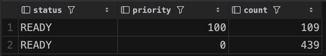
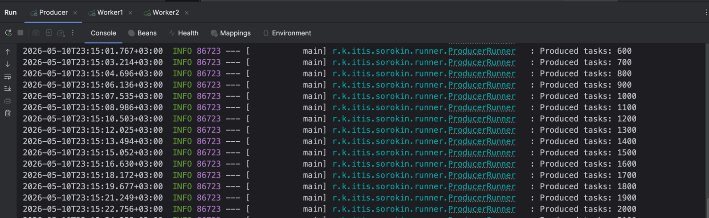
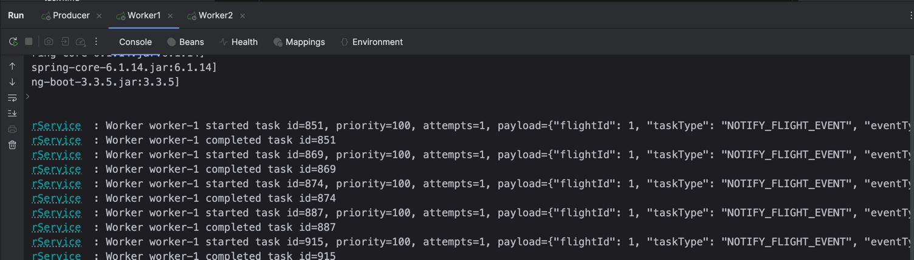
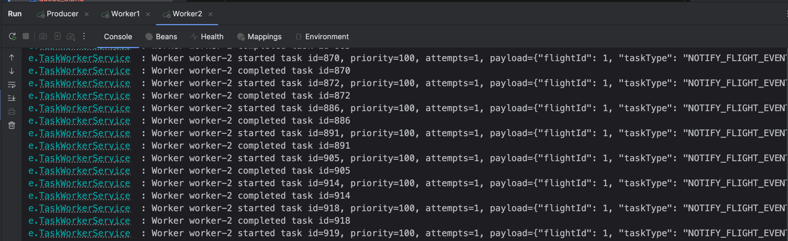
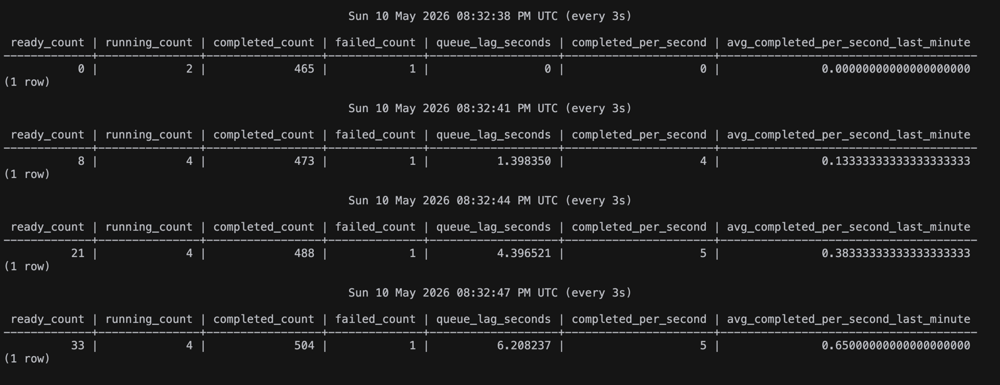
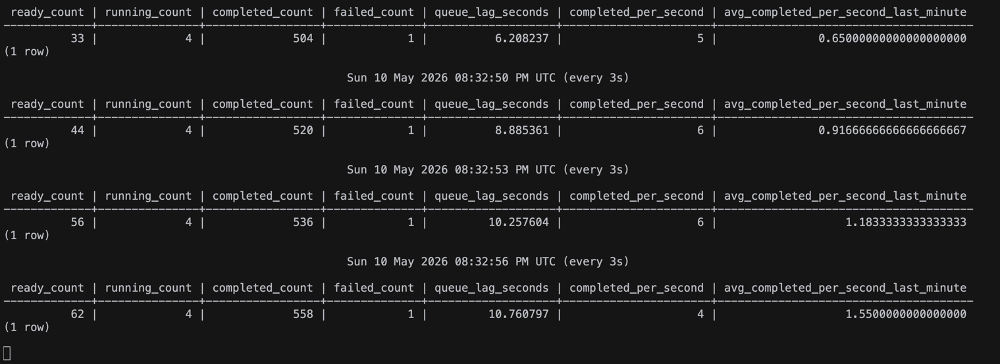
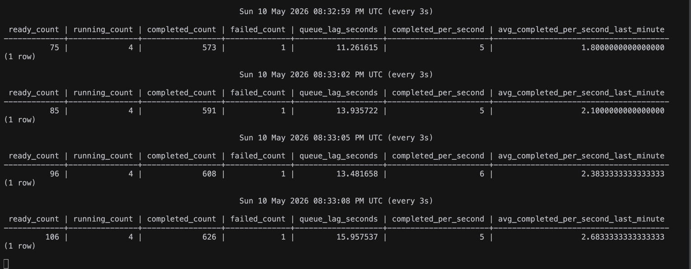
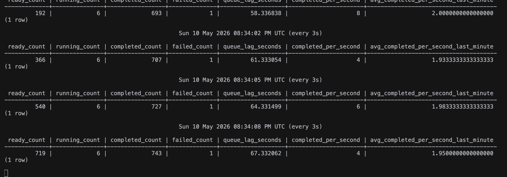
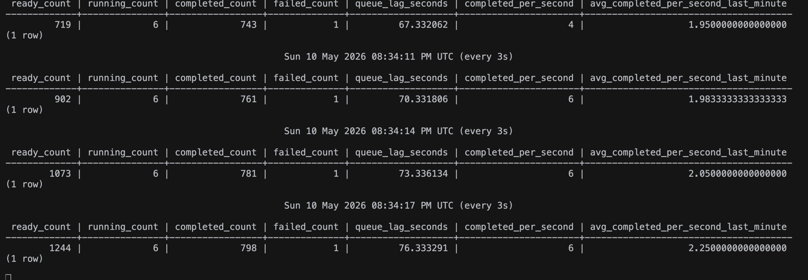
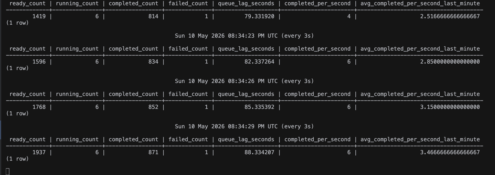

## Создание таблицы task

```sql
CREATE TABLE tasks
(
    id           BIGSERIAL PRIMARY KEY,
    payload      JSONB       NOT NULL,
    priority     INT         NOT NULL DEFAULT 0,
    status       VARCHAR(32) NOT NULL,
    attempts     INT         NOT NULL DEFAULT 0,
    created_at   TIMESTAMPTZ NOT NULL DEFAULT now(),
    updated_at   TIMESTAMPTZ NOT NULL DEFAULT now(),
    scheduled_at TIMESTAMPTZ NOT NULL DEFAULT now(),
    started_at   TIMESTAMPTZ,
    completed_at TIMESTAMPTZ,

    CONSTRAINT chk_tasks_status
        CHECK (status IN ('READY', 'RUNNING', 'COMPLETED', 'FAILED')),
    CONSTRAINT chk_tasks_attempts
        CHECK (attempts >= 0)
);

CREATE INDEX idx_tasks_ready_priority_created_at
    ON tasks (priority DESC, created_at ASC)
    WHERE status = 'READY';

CREATE INDEX idx_tasks_ready_scheduled_at
    ON tasks (scheduled_at)
    WHERE status = 'READY';

CREATE INDEX idx_tasks_completed_at
    ON tasks (completed_at)
    WHERE status = 'COMPLETED';
```

## Реализация Producer

Реализован producer, запускается с помощью runner
В application.yml можно задать количество генерируемых задач в секунду

```yaml
producer:
  rate-per-second: 100
```

```sql
SELECT status, priority, COUNT(*)
FROM tasks
GROUP BY status, priority
ORDER BY priority DESC, status;
```



## Реализация Сonsumer

```java
public record TaskToProcess(
        long id,
        String payload,
        int priority,
        int attempts
) {
}

public Optional<TaskToProcess> claimNextTask() {
        return jdbcTemplate.query(
                """
                WITH next_task AS (
                    SELECT id
                    FROM tasks
                    WHERE status = 'READY'
                      AND scheduled_at <= now()
                    ORDER BY priority DESC, created_at ASC
                    LIMIT 1
                    FOR UPDATE SKIP LOCKED
                )
                UPDATE tasks t
                SET status = 'RUNNING',
                    attempts = attempts + 1,
                    started_at = now(),
                    updated_at = now()
                FROM next_task
                WHERE t.id = next_task.id
                RETURNING t.id, t.payload::text, t.priority, t.attempts
                """,
                (rs, rowNum) -> new TaskToProcess(
                        rs.getLong("id"),
                        rs.getString("payload"),
                        rs.getInt("priority"),
                        rs.getInt("attempts")
                )
        ).stream().findFirst();
    }
```





## Мониторинг лаг и нагрузки

```sql
SELECT
    COUNT(*) FILTER (WHERE status = 'READY') AS ready_count,
    COUNT(*) FILTER (WHERE status = 'RUNNING') AS running_count,
    COUNT(*) FILTER (WHERE status = 'COMPLETED') AS completed_count,
    COUNT(*) FILTER (WHERE status = 'FAILED') AS failed_count,
    COALESCE(
        EXTRACT(EPOCH FROM (
            now() - (MIN(created_at) FILTER (WHERE status = 'READY'))
        )),
        0
    ) AS queue_lag_seconds,
    COUNT(*) FILTER (
        WHERE status = 'COMPLETED'
          AND completed_at >= now() - interval '1 second'
    ) AS completed_per_second,
    COUNT(*) FILTER (
        WHERE status = 'COMPLETED'
          AND completed_at >= now() - interval '1 minute'
    ) / 60.0 AS avg_completed_per_second_last_minute
FROM tasks;
```

Запускаю producer и 2 consumer-а для мониторинга и запрос выше раз в 3 секунды





Это нагрузка 10 событий в секунду на producer






Это нагрузка 100 событий в секунду на producer