# Отчет по заданию Airflow: ETL и аналитическая обработка данных

## 1. Выбранные источники данных

**Источник 1 — CSV-файл (orders.csv):**
Содержит 34 записи о заказах магазина. Поля: order_id, customer_id, product_id, quantity, price, order_date.

содержание файла orders.csv

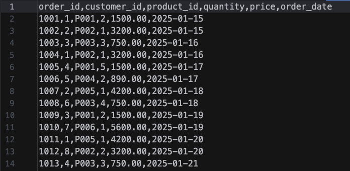

**Источник 2 — JSON-файл (products.json):**
Содержит справочник из 8 товаров. Поля: product_id, name, category, supplier, cost.

содержание файла products.json

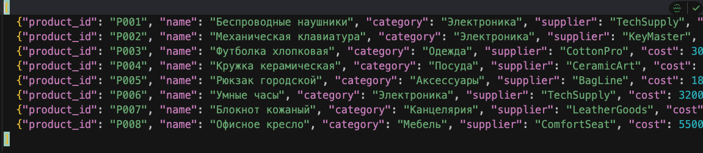

---

## 2. Таблицы проекта в PostgreSQL

В основной БД проекта созданы две таблицы:

- **products** — справочник товаров
- **orders** — заказы

структура таблиц в PostgreSQL

```sql
CREATE TABLE IF NOT EXISTS products (
    product_id   VARCHAR(10) PRIMARY KEY,
    name         VARCHAR(200) NOT NULL,
    category     VARCHAR(100) NOT NULL,
    supplier     VARCHAR(100),
    cost         NUMERIC(12, 2) NOT NULL
);

CREATE TABLE IF NOT EXISTS orders (
    order_id     INTEGER PRIMARY KEY,
    customer_id  INTEGER NOT NULL,
    product_id   VARCHAR(10) NOT NULL REFERENCES products(product_id),
    quantity     INTEGER NOT NULL CHECK (quantity > 0),
    price        NUMERIC(12, 2) NOT NULL CHECK (price >= 0),
    order_date   DATE NOT NULL
);
```


---

## 3. Устройство DAG 1 — ETL

DAG `etl_csv_json_to_postgres` состоит из пяти задач:

```
extract_products_from_json ──> load_products_to_pg  ──┐
                                                      ├──> run_quality_checks
extract_orders_from_csv ──────> load_orders_to_pg ────┘
```

Описание задач:
- **extract_products_from_json** — читает JSON, проверяет наличие обязательных полей (product_id, name, category, cost)
- **extract_orders_from_csv** — читает CSV через DictReader, проверяет колонки и типы данных
- **load_products_to_pg** — очищает таблицы (TRUNCATE CASCADE) и вставляет товары (ON CONFLICT DO UPDATE — идемпотентность)
- **load_orders_to_pg** — вставляет заказы после загрузки товаров (FK-зависимость)
- **run_quality_checks** — 4 проверки: непустые таблицы, отсутствие NULL в ключах, ссылочная целостность, отрицательные значения

граф DAG 1

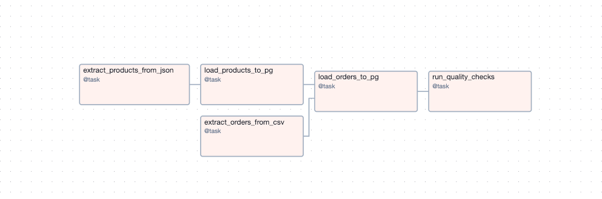

успешный запуск DAG 1

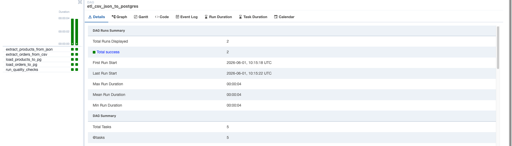

логи задачи run_quality_checks

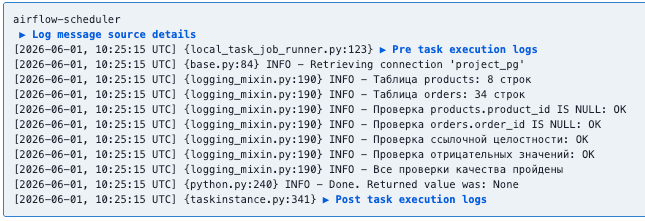

---

## 4. Устройство DAG 2 — Analytics

DAG `analytics_pg_to_clickhouse` состоит из четырех задач:

```
extract_from_pg ──> load_to_clickhouse ──> build_sales_mart ──> quality_checks_ch
```

Описание задач:
- **extract_from_pg** — читает таблицы orders и products из PostgreSQL
- **load_to_clickhouse** — очищает ClickHouse (TRUNCATE) и вставляет сырые данные (идемпотентность)
- **build_sales_mart** — строит витрину с агрегациями по дням и категориям (sumState, countState, uniqState)
- **quality_checks_ch** — проверяет непустоту таблиц, консистентность числа заказов

граф DAG 2 в Airflow UI

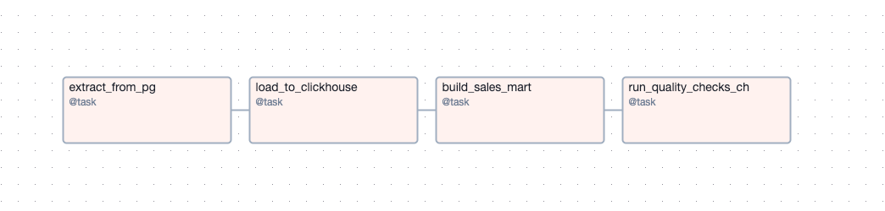

успешный запуск DAG 2

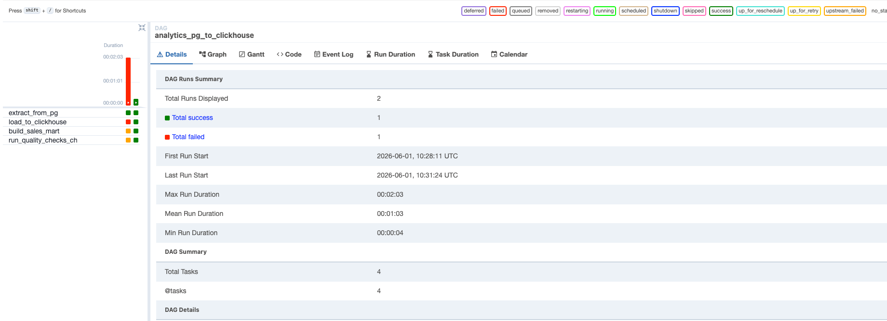

---

## 5. Таблицы в ClickHouse

- **orders_raw** (MergeTree) — сырые заказы, партиционирование по order_date
- **products_raw** (MergeTree) — сырой справочник товаров
- **sales_mart** (AggregatingMergeTree) — витрина с агрегатными функциями

```sql
CREATE TABLE IF NOT EXISTS orders_raw (
    order_id     Int32,
    customer_id  Int32,
    product_id   String,
    quantity     Int32,
    price        Decimal(12, 2),
    order_date   Date
) ENGINE = MergeTree()
ORDER BY (order_date, order_id);

CREATE TABLE IF NOT EXISTS products_raw (
    product_id   String,
    name         String,
    category     String,
    supplier     String,
    cost         Decimal(12, 2)
) ENGINE = MergeTree()
ORDER BY product_id;

-- Аналитическая витрина: продажи по дням и категориям
CREATE TABLE IF NOT EXISTS sales_mart (
    order_date   Date,
    category     String,
    total_revenue  AggregateFunction(sum, Decimal(12, 2)),
    order_count    AggregateFunction(count, Int32),
    unique_customers AggregateFunction(uniq, Int32)
) ENGINE = AggregatingMergeTree()
ORDER BY (order_date, category);

```

---

## 6. Аналитическая витрина

Витрина `sales_mart` агрегирует данные в разрезе «дата + категория товара».

Поля витрины:
- order_date — дата заказа
- category — категория товара
- total_revenue — суммарная выручка (AggregateFunction sum)
- order_count — количество заказов (AggregateFunction count)
- unique_customers — уникальные покупатели (AggregateFunction uniq)

содержимое sales_mart

```sql
SELECT
    order_date,
    category,
    sumMerge(total_revenue) AS total_amount,
    countMerge(order_count) AS orders_count
FROM sales_mart
GROUP BY
    order_date,
    category
ORDER BY
    order_date ASC,
    category ASC;
```

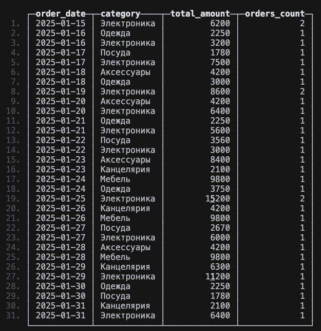

---

## 7. Метрики

На основе витрины рассчитываются:

1. **Общая выручка** за период: `sumMerge(total_revenue)`
2. **Количество заказов**: `countMerge(order_count)`
3. **Уникальные клиенты**: `uniqMerge(unique_customers)`
4. **Средний чек**: `total_revenue / total_orders`
5. **Топ-5 товаров** по выручке

вывод метрик в логах задачи build_sales_mart

```txt
airflow-scheduler
 ▶ Log message source details
[2026-06-01, 10:31:26 UTC] {local_task_job_runner.py:123} ▶ Pre task execution logs
[2026-06-01, 10:31:26 UTC] {logging_mixin.py:190} INFO - === Аналитическая витрина (sales_mart) ===
[2026-06-01, 10:31:26 UTC] {logging_mixin.py:190} INFO -         Дата | Категория        |    Выручка |  Заказов |  Клиентов
[2026-06-01, 10:31:26 UTC] {logging_mixin.py:190} INFO - ----------------------------------------------------------------------
[2026-06-01, 10:31:26 UTC] {logging_mixin.py:190} INFO -   2025-01-15 | Электроника      |    6200.00 |        2 |         2
[2026-06-01, 10:31:26 UTC] {logging_mixin.py:190} INFO -   2025-01-16 | Одежда           |    2250.00 |        1 |         1
[2026-06-01, 10:31:26 UTC] {logging_mixin.py:190} INFO -   2025-01-16 | Электроника      |    3200.00 |        1 |         1
[2026-06-01, 10:31:26 UTC] {logging_mixin.py:190} INFO -   2025-01-17 | Посуда           |    1780.00 |        1 |         1
[2026-06-01, 10:31:26 UTC] {logging_mixin.py:190} INFO -   2025-01-17 | Электроника      |    7500.00 |        1 |         1
[2026-06-01, 10:31:26 UTC] {logging_mixin.py:190} INFO -   2025-01-18 | Аксессуары       |    4200.00 |        1 |         1
[2026-06-01, 10:31:26 UTC] {logging_mixin.py:190} INFO -   2025-01-18 | Одежда           |    3000.00 |        1 |         1
[2026-06-01, 10:31:26 UTC] {logging_mixin.py:190} INFO -   2025-01-19 | Электроника      |    8600.00 |        2 |         2
[2026-06-01, 10:31:26 UTC] {logging_mixin.py:190} INFO -   2025-01-20 | Аксессуары       |    4200.00 |        1 |         1
[2026-06-01, 10:31:26 UTC] {logging_mixin.py:190} INFO -   2025-01-20 | Электроника      |    6400.00 |        1 |         1
[2026-06-01, 10:31:26 UTC] {logging_mixin.py:190} INFO -   2025-01-21 | Одежда           |    2250.00 |        1 |         1
[2026-06-01, 10:31:26 UTC] {logging_mixin.py:190} INFO -   2025-01-21 | Электроника      |    5600.00 |        1 |         1
[2026-06-01, 10:31:26 UTC] {logging_mixin.py:190} INFO -   2025-01-22 | Посуда           |    3560.00 |        1 |         1
[2026-06-01, 10:31:26 UTC] {logging_mixin.py:190} INFO -   2025-01-22 | Электроника      |    3000.00 |        1 |         1
[2026-06-01, 10:31:26 UTC] {logging_mixin.py:190} INFO -   2025-01-23 | Аксессуары       |    8400.00 |        1 |         1
[2026-06-01, 10:31:26 UTC] {logging_mixin.py:190} INFO -   2025-01-23 | Канцелярия       |    2100.00 |        1 |         1
[2026-06-01, 10:31:26 UTC] {logging_mixin.py:190} INFO -   2025-01-24 | Мебель           |    9800.00 |        1 |         1
[2026-06-01, 10:31:26 UTC] {logging_mixin.py:190} INFO -   2025-01-24 | Одежда           |    3750.00 |        1 |         1
[2026-06-01, 10:31:26 UTC] {logging_mixin.py:190} INFO -   2025-01-25 | Электроника      |   15200.00 |        2 |         2
[2026-06-01, 10:31:26 UTC] {logging_mixin.py:190} INFO -   2025-01-26 | Канцелярия       |    4200.00 |        1 |         1
[2026-06-01, 10:31:26 UTC] {logging_mixin.py:190} INFO -   2025-01-26 | Мебель           |    9800.00 |        1 |         1
[2026-06-01, 10:31:26 UTC] {logging_mixin.py:190} INFO -   2025-01-27 | Посуда           |    2670.00 |        1 |         1
[2026-06-01, 10:31:26 UTC] {logging_mixin.py:190} INFO -   2025-01-27 | Электроника      |    6000.00 |        1 |         1
[2026-06-01, 10:31:26 UTC] {logging_mixin.py:190} INFO -   2025-01-28 | Аксессуары       |    4200.00 |        1 |         1
[2026-06-01, 10:31:26 UTC] {logging_mixin.py:190} INFO -   2025-01-28 | Мебель           |    9800.00 |        1 |         1
[2026-06-01, 10:31:26 UTC] {logging_mixin.py:190} INFO -   2025-01-29 | Канцелярия       |    6300.00 |        1 |         1
[2026-06-01, 10:31:26 UTC] {logging_mixin.py:190} INFO -   2025-01-29 | Электроника      |   11200.00 |        1 |         1
[2026-06-01, 10:31:26 UTC] {logging_mixin.py:190} INFO -   2025-01-30 | Одежда           |    2250.00 |        1 |         1
[2026-06-01, 10:31:26 UTC] {logging_mixin.py:190} INFO -   2025-01-30 | Посуда           |    1780.00 |        1 |         1
[2026-06-01, 10:31:26 UTC] {logging_mixin.py:190} INFO -   2025-01-31 | Канцелярия       |    2100.00 |        1 |         1
[2026-06-01, 10:31:26 UTC] {logging_mixin.py:190} INFO -   2025-01-31 | Электроника      |    6400.00 |        1 |         1
[2026-06-01, 10:31:26 UTC] {logging_mixin.py:190} INFO - 
=== Итоговые метрики ===
[2026-06-01, 10:31:26 UTC] {logging_mixin.py:190} INFO - Общая выручка: 167,690.00 руб.
[2026-06-01, 10:31:26 UTC] {logging_mixin.py:190} INFO - Всего заказов: 34
[2026-06-01, 10:31:26 UTC] {logging_mixin.py:190} INFO - Уникальных клиентов: 10
[2026-06-01, 10:31:26 UTC] {logging_mixin.py:190} INFO - Средний чек: 4,932.05 руб.
[2026-06-01, 10:31:26 UTC] {logging_mixin.py:190} INFO - 
=== Топ-5 товаров по выручке ===
[2026-06-01, 10:31:26 UTC] {logging_mixin.py:190} INFO - 1. Офисное кресло (Мебель) — 29,400.00 руб. | продано 3 шт.
[2026-06-01, 10:31:26 UTC] {logging_mixin.py:190} INFO - 2. Механическая клавиатура (Электроника) — 28,800.00 руб. | продано 9 шт.
[2026-06-01, 10:31:26 UTC] {logging_mixin.py:190} INFO - 3. Умные часы (Электроника) — 28,000.00 руб. | продано 5 шт.
[2026-06-01, 10:31:26 UTC] {logging_mixin.py:190} INFO - 4. Беспроводные наушники (Электроника) — 22,500.00 руб. | продано 15 шт.
[2026-06-01, 10:31:26 UTC] {logging_mixin.py:190} INFO - 5. Рюкзак городской (Аксессуары) — 21,000.00 руб. | продано 5 шт.
[2026-06-01, 10:31:26 UTC] {python.py:240} INFO - Done. Returned value was: None
[2026-06-01, 10:31:26 UTC] {taskinstance.py:341} ▶ Post task execution logs
```

---

## 8. Идемпотентность

Идемпотентность (повторный запуск дает тот же результат) обеспечена:

- **DAG 1**: `TRUNCATE TABLE orders CASCADE` + `TRUNCATE TABLE products CASCADE` перед вставкой. 
  INSERT с `ON CONFLICT DO UPDATE` — повторная вставка тех же данных не дублирует строки.
- 
- **DAG 2**: `TRUNCATE TABLE IF EXISTS` для orders_raw, products_raw и sales_mart перед каждой загрузкой.
  Данные полностью перезаписываются, а не дополняются.

---

## 9. Проверки качества данных

**В DAG 1:**
1. Таблицы не пусты после загрузки
2. Нет NULL в ключевых полях (product_id, order_id)
3. Ссылочная целостность: каждый order.product_id существует в products
4. Нет отрицательных quantity или price

**В DAG 2:**
1. Таблицы ClickHouse не пусты
2. Нет «осиротевших» заказов (без товара)
3. Консистентность: число заказов в orders_raw = число заказов в sales_mart

логи проверок DAG 1

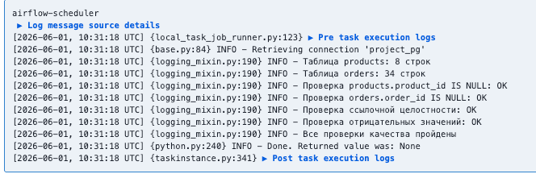

логи проверок DAG 2

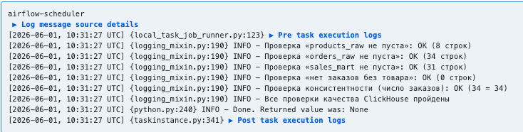

---

## 10. Как запустить проект

```bash
cd s2/airflow

docker compose up -d

#Открыть Airflow UI
open http://localhost:8080
# Логин: admin / Пароль: admin

# Включить DAG
# и запустить вручную через UI (кнопка Play)
```

список DAG'ов в Airflow UI
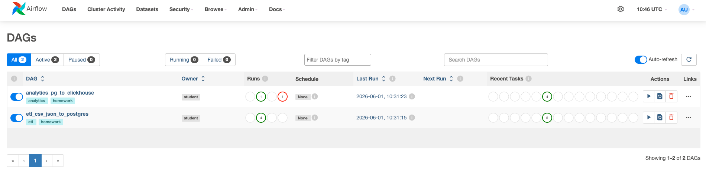

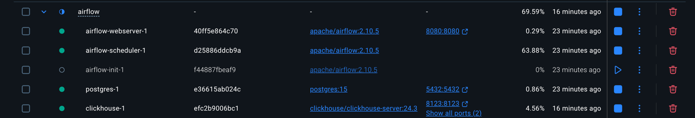

---
