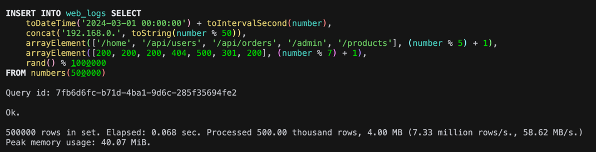
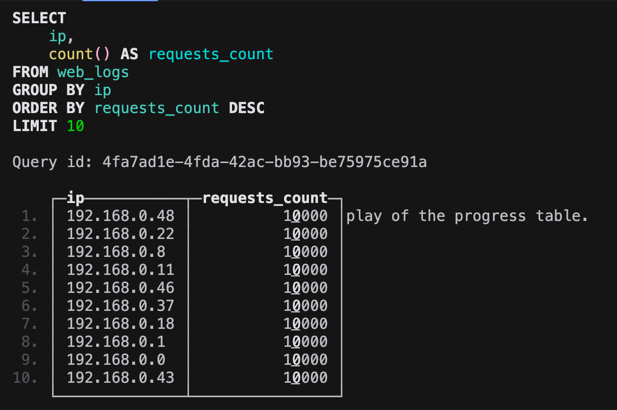
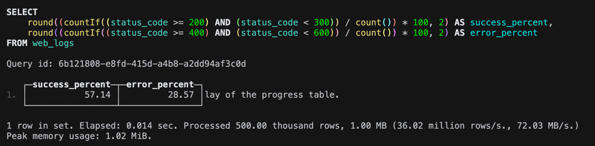
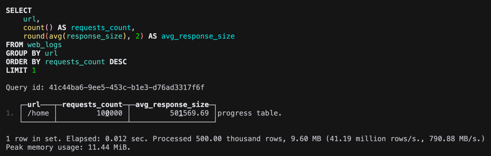
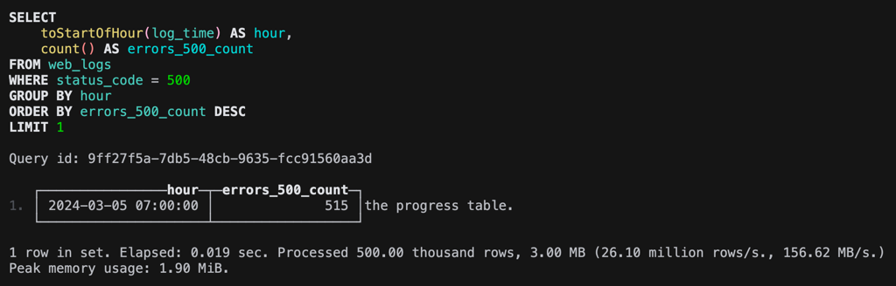
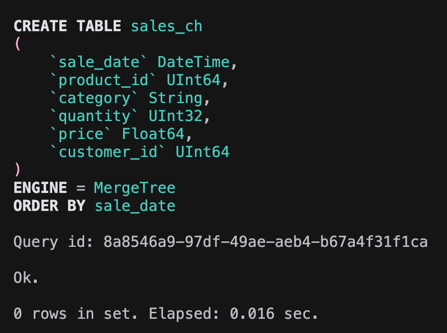
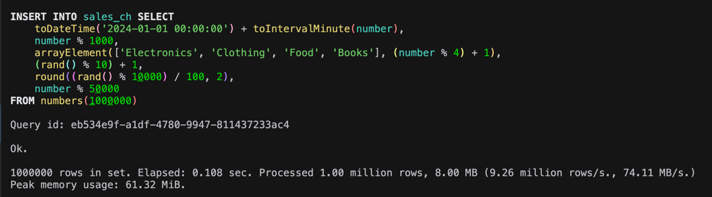
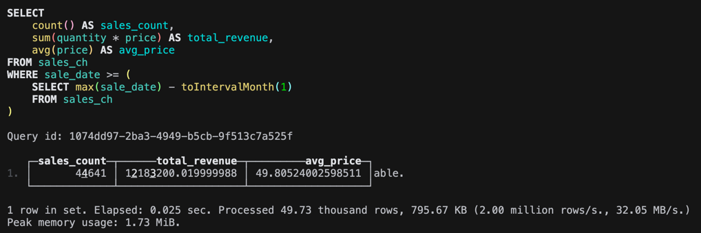
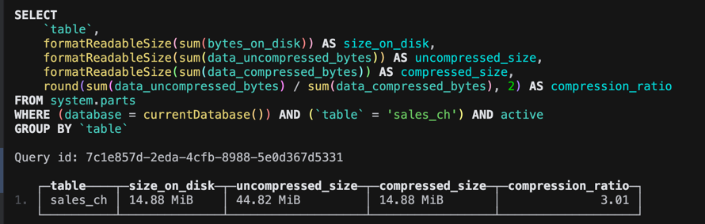

```sql
DROP TABLE IF EXISTS web_logs;

CREATE TABLE web_logs (
    log_time DateTime,
    ip String,
    url String,
    status_code UInt16,
    response_size UInt64
) ENGINE = MergeTree()
ORDER BY (log_time, status_code);
```




## 1 Найдите топ-10 IP-адресов по количеству запросов.




## 2 Посчитайте процент успешных запросов (2xx) и ошибочных (4xx, 5xx).




## 3 Найдите самый популярный URL и средний размер ответа для него.




## 4 Определите час с наибольшим количеством ошибок 500.




# Сравнение с PostgreSQL





Время: 0.108 sec


```sql
\timing on

DROP TABLE IF EXISTS sales_pg;

CREATE TABLE sales_pg
(
    sale_date   timestamp,
    product_id  bigint,
    category    text,
    quantity    integer,
    price       float8,
    customer_id bigint
);

CREATE INDEX idx_sales_pg_date ON sales_pg(sale_date);
CREATE INDEX idx_sales_pg_product ON sales_pg(product_id);

INSERT INTO sales_pg
SELECT
    '2024-01-01 00:00:00'::timestamp + (n || ' minutes')::interval,
    n % 1000,
    CASE (n % 4)
        WHEN 0 THEN 'Electronics'
        WHEN 1 THEN 'Clothing'
        WHEN 2 THEN 'Food'
        ELSE 'Books'
        END,
    (random() * 9 + 1)::integer,
    round((random() * 100)::numeric, 2),
    n % 50000
FROM generate_series(1, 1000000) AS n;


[2026-05-01 15:51:20] 1,000,000 rows affected in 4 s 693 ms
```

Время: 4 s 693 ms


#### Запросы на продажи



Время: 0.025

```sql
SELECT
    count(*) AS sales_count,
    sum(quantity * price) AS total_revenue,
    avg(price) AS avg_price
FROM sales_pg
WHERE sale_date >= (
    SELECT max(sale_date) - INTERVAL '1 month'
    FROM sales_pg
);

161 ms (execution: 18 ms, fetching: 143 ms)
```

Время: 0.161 sec

#### Сравнение сжатия




Итог: ClickHouse сжал в 6.85 раз лучше, чем PostgreSQL


## Ответьте на вопросы:

1. Какая СУБД быстрее вставила 1 млн строк?
2. Во сколько раз ClickHouse сжал данные эффективнее?
3. Какой вывод можно сделать о выборе СУБД для аналитики?
4. Разница ClickHouse и PostgreSQL

---

1. ClickHouse
2. в 6.85 раз
3. Для аналитики будет определенно лучше ClickHouse. Так как эффективнее сжимает данные, оптимизирован для аналитических больших запросов
4. ClickHouse - скорость, аналитика, PostgreSQL - надежность, транзакции