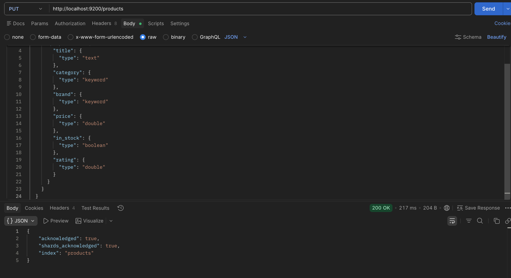
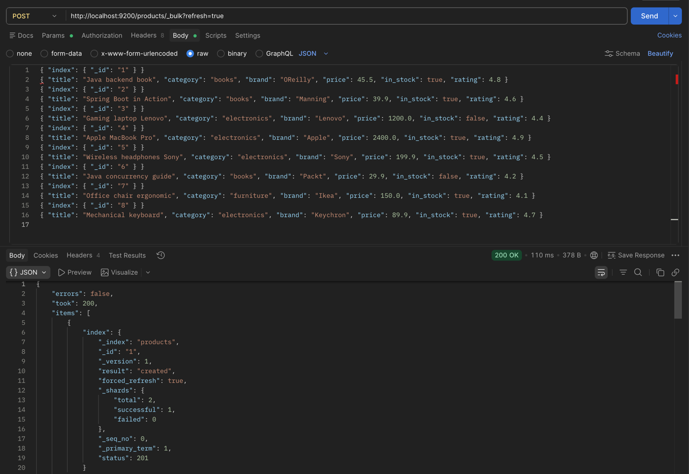
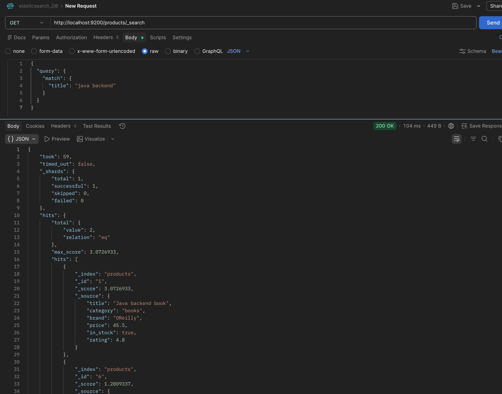
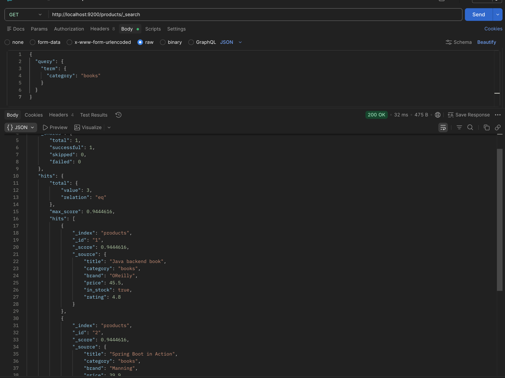
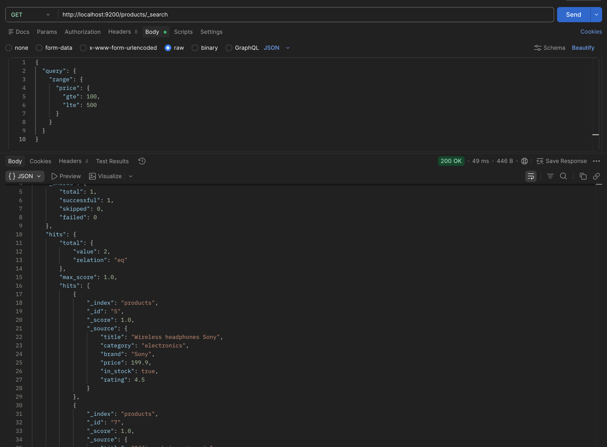
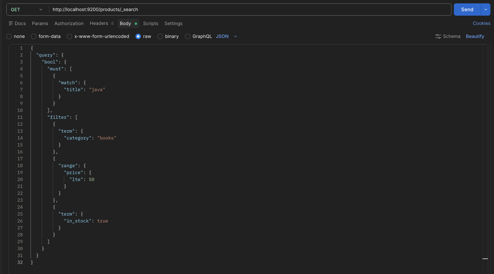
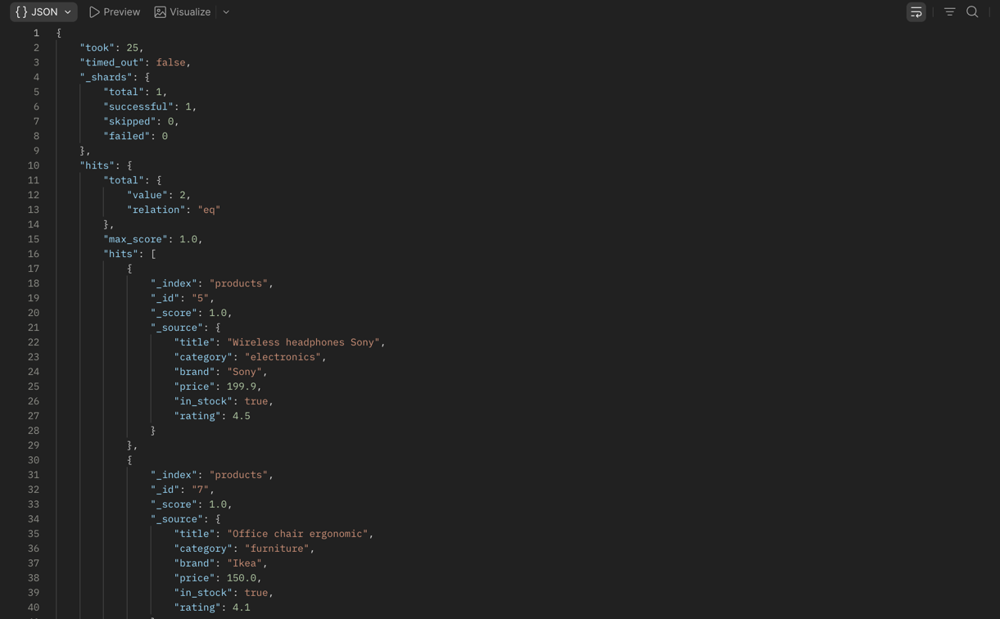

Запустил контейнер с elasticsearch

Создание индекса

Вставка данных

Получение данных, match

Получение данных, term (точное совпадение)

Получение данных, rang (диапазон цен)

Получение данных, bool (комбинированный запрос)

