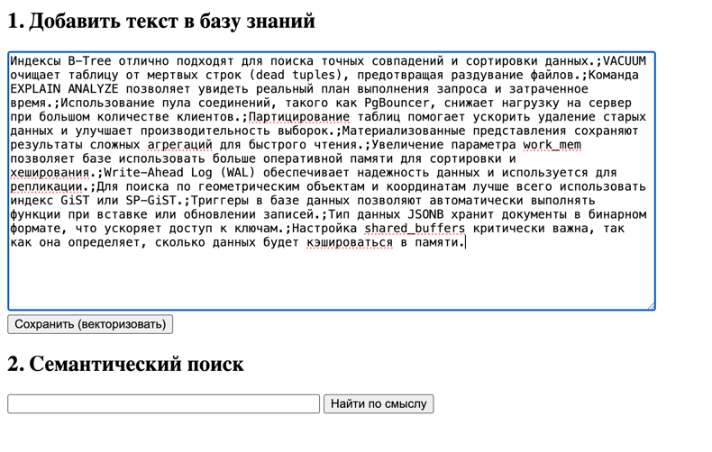
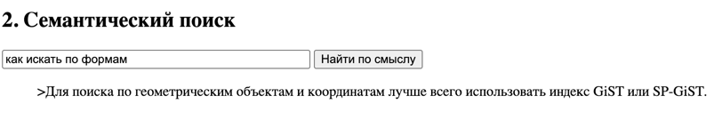
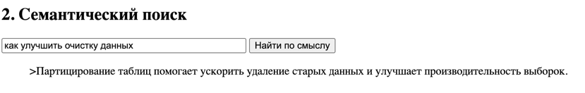
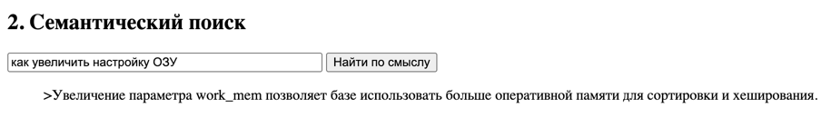
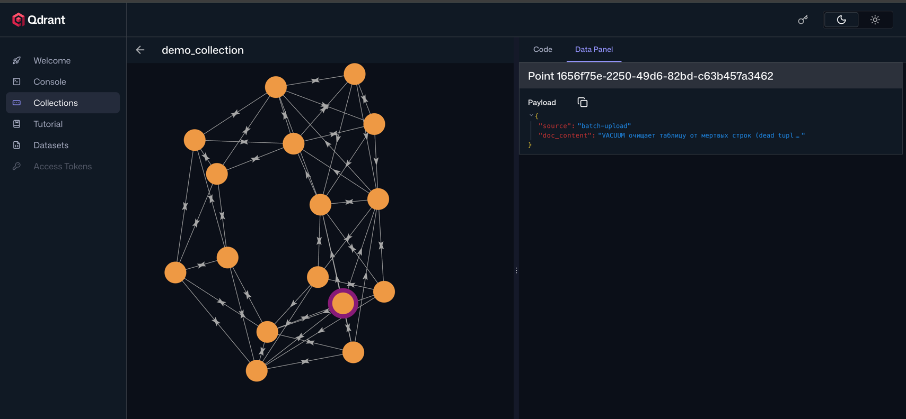

1) Склонировать репозиторий https://github.com/ZhenShenITIS/hw-qdrant (склонировал)
2) Запустить в консоли `docker compose up -d --build` (запустил)
3) Подождать 5-10 минут (Будет происходить сборка проекта и скачивание модели) (подождал X_X)

