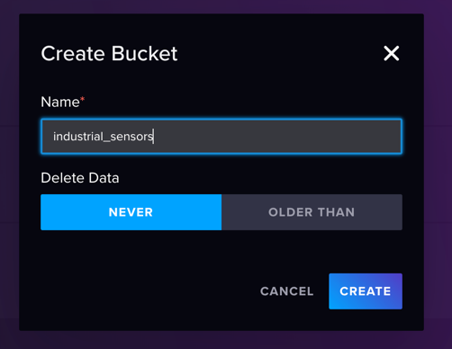
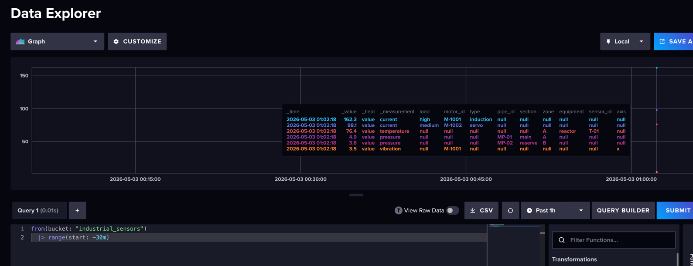
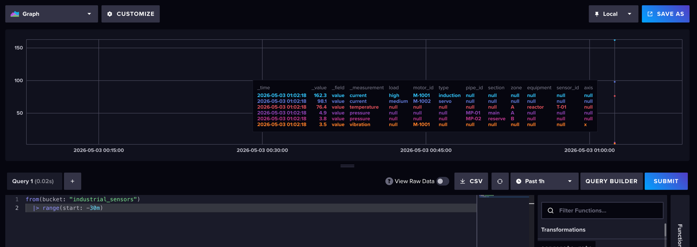
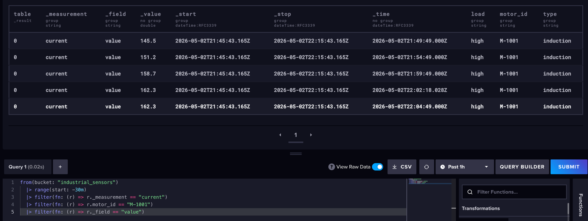
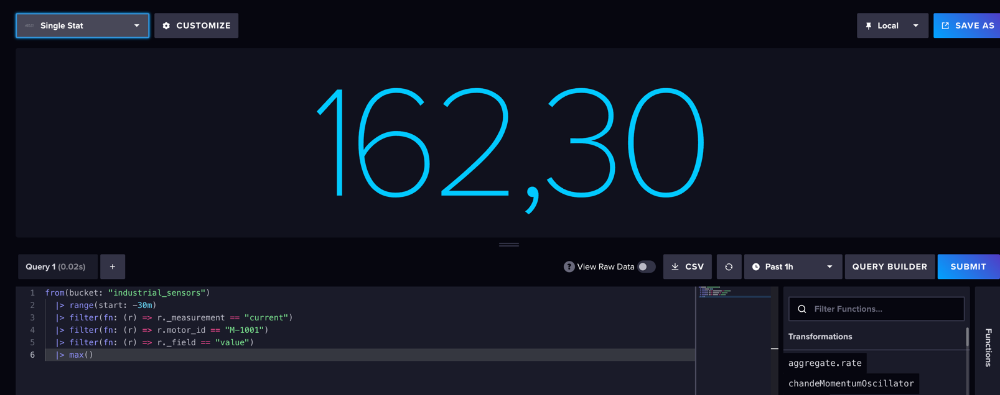
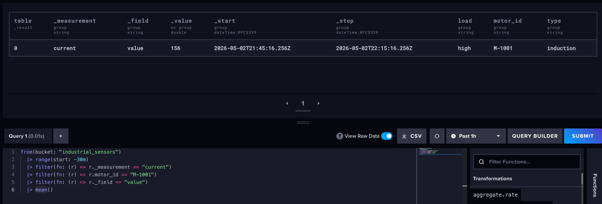
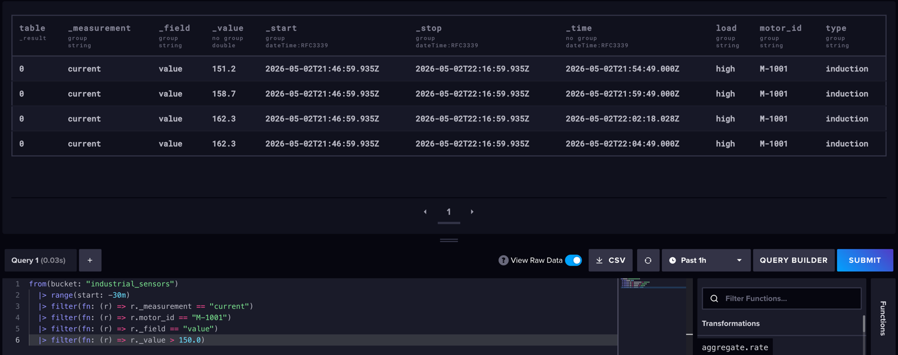
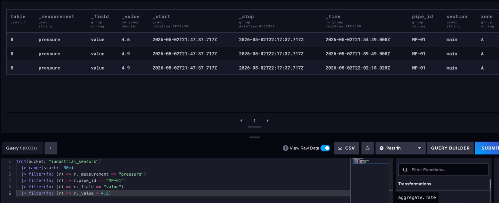
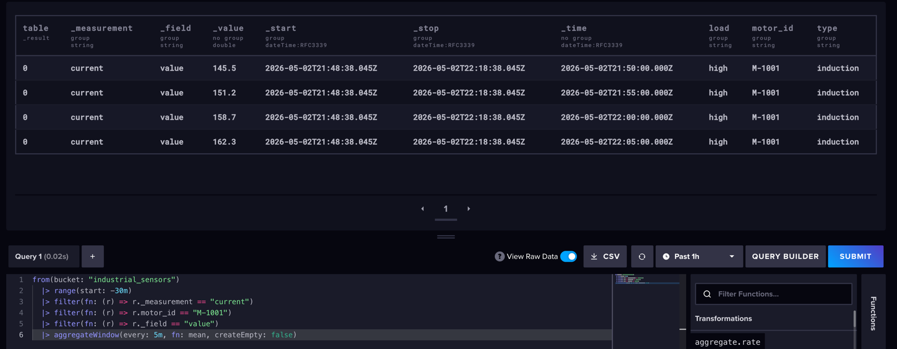
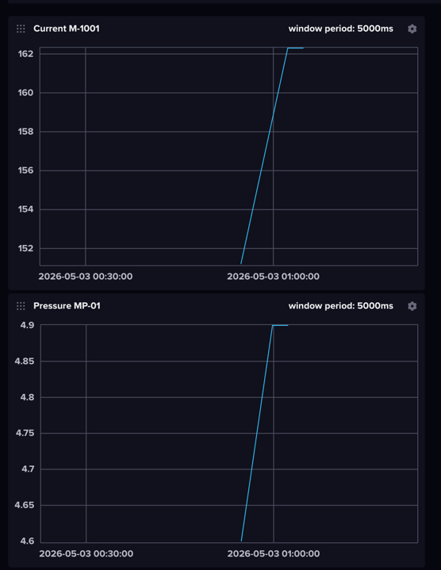

## Задание 1. Установка и запуск InfluxDB

Создал docker compose

## Задание 2. Создание базы через веб-интерфейс



## Задание 3. Наполнение данными (промышленных) датчиков

Создал файл indistrial_sensors.lp

```txt
current,motor_id=M-1001,type=induction,load=high value=145.5
current,motor_id=M-1001,type=induction,load=high value=151.2
current,motor_id=M-1001,type=induction,load=high value=158.7
current,motor_id=M-1001,type=induction,load=high value=162.3

current,motor_id=M-1002,type=servo,load=medium value=91.4
current,motor_id=M-1002,type=servo,load=medium value=94.8
current,motor_id=M-1002,type=servo,load=medium value=98.1
...
```

```bash
curl -i -XPOST "http://localhost:8086/api/v2/write?org=myorg&bucket=industrial_sensors&precision=ns" \
  --header "Authorization: Token my-token-123" \
  --header "Content-Type: text/plain; charset=utf-8" \
  --data-binary @industrial_sensors.lp
```



## Задание 4. Базовые запросы

- Просмотреть все данные за последние 30 минут



- Посмотреть измерения только 1 датчика



- Максимальное значение на 1 датчике



- Среднее значение на датчике



- 2-3 аналитических запроса с фильтром по значению

Ток выше 150



Давление больше 4.5


- Запрос на агрегацию данных

Агрегация данных по окнам в 5 минут



## Задание 5. Создайте Dashboard с 1-2 графиками

