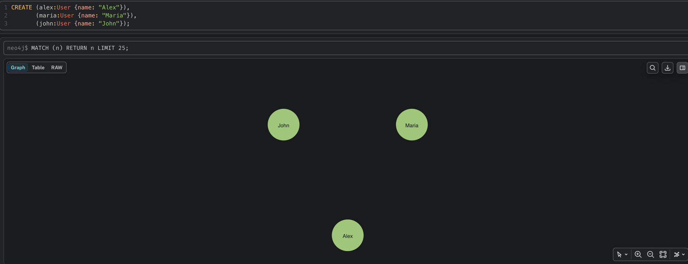
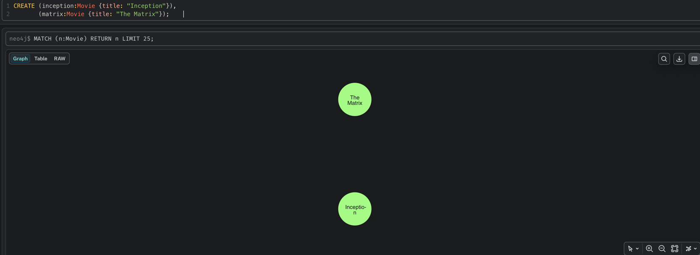
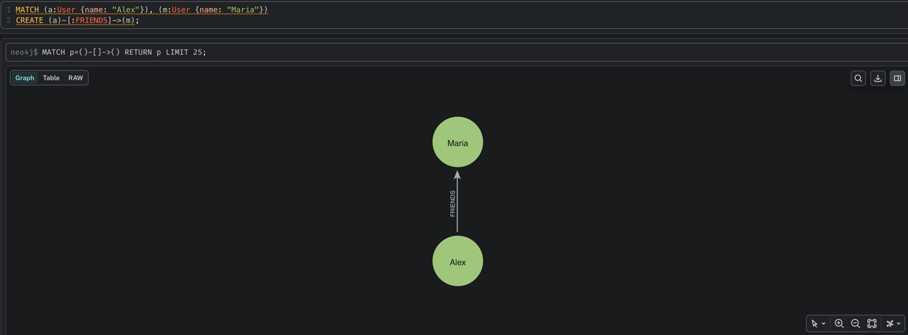
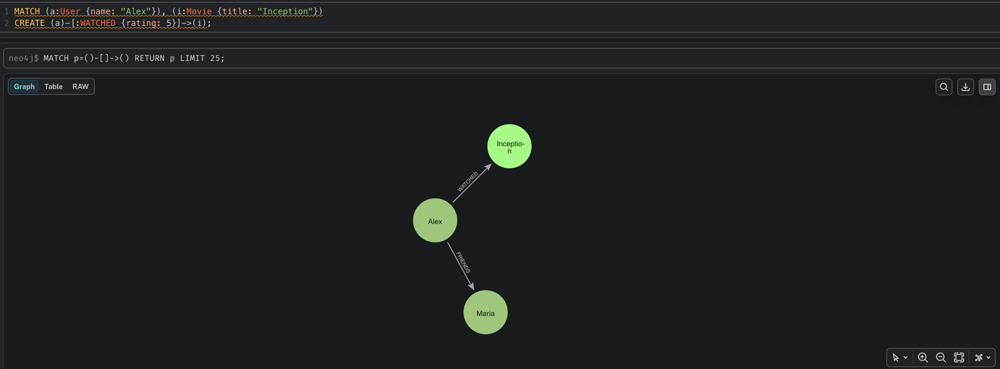
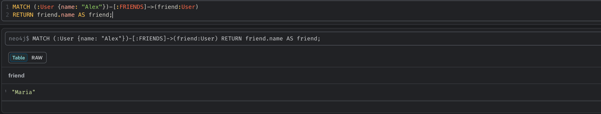
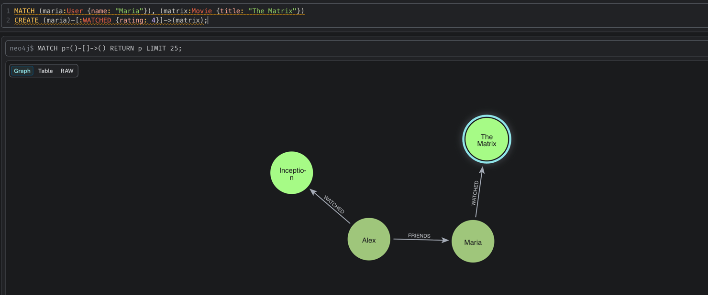
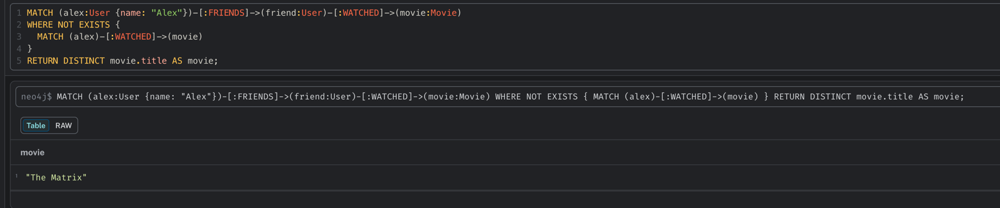
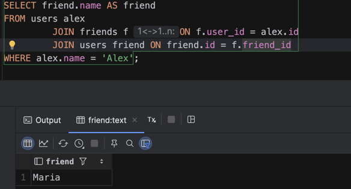
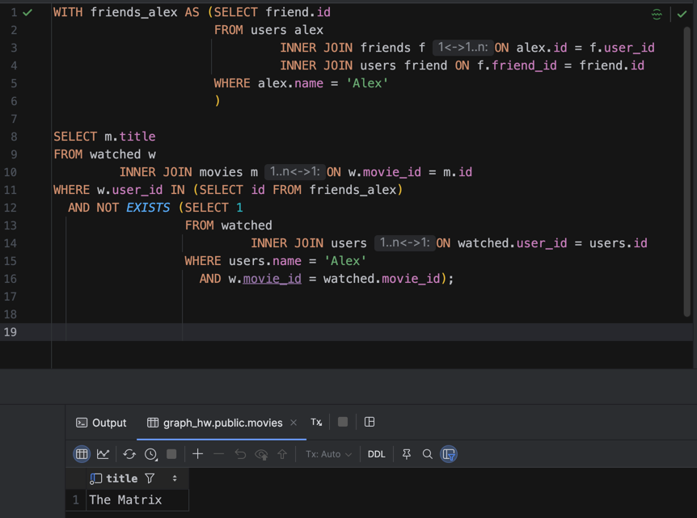

## Создание данных









### Найти всех друзей Алекса



### Фильмы, которые смотрели друзья Алекса, но не смотрел Алекс

Сначала добавим фильм, который посмотрели друзья алекса (добавил связь)





# С использованием PostgreSQL

```sql
DROP TABLE IF EXISTS watched;
DROP TABLE IF EXISTS friends;
DROP TABLE IF EXISTS movies;
DROP TABLE IF EXISTS users;

CREATE TABLE users
(
    id   BIGSERIAL PRIMARY KEY,
    name TEXT NOT NULL UNIQUE
);

CREATE TABLE movies
(
    id    BIGSERIAL PRIMARY KEY,
    title TEXT NOT NULL UNIQUE
);

CREATE TABLE friends
(
    user_id   BIGINT NOT NULL REFERENCES users (id),
    friend_id BIGINT NOT NULL REFERENCES users (id),
    PRIMARY KEY (user_id, friend_id)
);

CREATE TABLE watched
(
    user_id  BIGINT NOT NULL REFERENCES users (id),
    movie_id BIGINT NOT NULL REFERENCES movies (id),
    rating   INT,
    PRIMARY KEY (user_id, movie_id)
);
```

```sql
INSERT INTO users(name)
VALUES ('Alex'),
       ('Maria'),
       ('John');

INSERT INTO movies(title)
VALUES ('Inception'),
       ('The Matrix');

INSERT INTO friends(user_id, friend_id)
SELECT alex.id, maria.id
FROM users alex,
     users maria
WHERE alex.name = 'Alex'
  AND maria.name = 'Maria';

INSERT INTO watched(user_id, movie_id, rating)
SELECT alex.id, inception.id, 5
FROM users alex,
     movies inception
WHERE alex.name = 'Alex'
  AND inception.title = 'Inception';

INSERT INTO watched(user_id, movie_id, rating)
SELECT maria.id, matrix.id, 4
FROM users maria,
     movies matrix
WHERE maria.name = 'Maria'
  AND matrix.title = 'The Matrix';
```

### Найти всех друзей Алекса



### Фильмы, которые смотрели друзья Алекса, но не смотрел Алекс




### Вывод
Запросы при работе со связями через Neo4j пишутся гораздо проще и эффективнее. PostgreSQL в приницпе для этого не заточен
