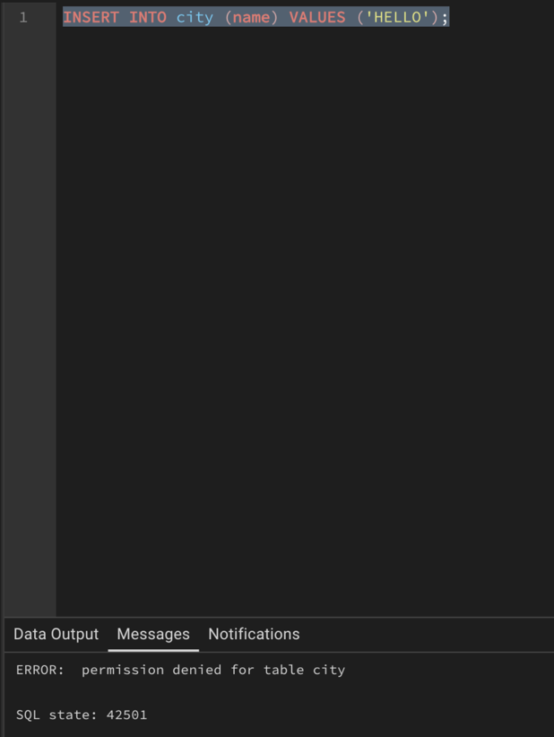

1. **Объем данных (> 1 млн строк)**
    - 5 таблиц (Client, Flight, Booking, Passenger, Ticket) по 250 000 строк каждая.

2. **Распределения данных**
   - Равномерное: Имена клиентов (SimpleFaker.name). 
   - Сильно неравномерное: booking.client_id. 10% клиентов делают 70% заказов. 
   - Низкая селективность: ticket.is_online_checkin (95% false, 5% true). 
   - Высокая селективность: booking.booking_token (UUID, почти 100% уникальны).

3. **Сложные типы данных**
   - JSONB: booking.contact_data. 
   - Массивы (Array): passenger.tags (список тегов). 
   - Полнотекстовый поиск (TSVector): passenger.search_vector (для быстрого поиска по ФИО). 
   - Геометрия (Point): booking.user_location (координаты пользователя при покупке). 
   - Диапазоны (Range): flight.flight_time_range (интервал времени полета).

4. **NULL-значения**
   - Реализация: ticket.meal_choice (80% NULL)
   - flight.actual_arrival_time (20% NULL, рейс еще летит).

