# Сравнение запросов без ингдексов и с индексами

## Запросы без индексов

---

#### \>

```sql
EXPLAIN ANALYZE SELECT first_name || ' ' || last_name as FIO, birthdate
FROM passenger
WHERE birthdate > '1990-01-01';
```

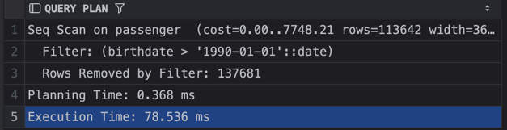

```sql
EXPLAIN (ANALYZE, BUFFERS) SELECT first_name || ' ' || last_name as FIO, birthdate
FROM passenger
WHERE birthdate > '1990-01-01';
```
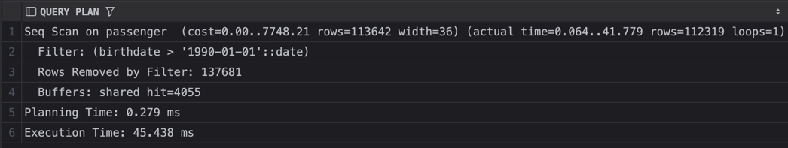

---

#### \<

```sql
EXPLAIN (ANALYZE, BUFFERS) SELECT first_name || ' ' || last_name as FIO, birthdate
FROM passenger
WHERE birthdate < '1990-01-01';
```

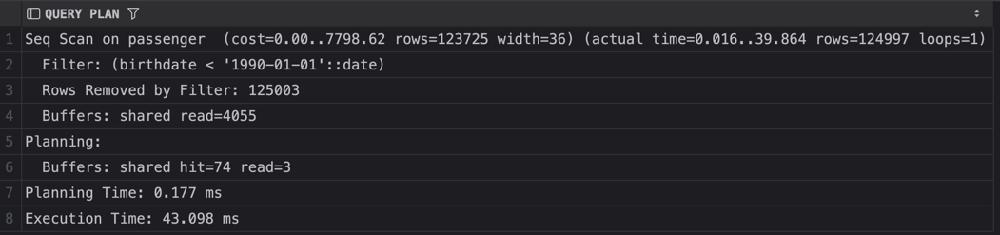

```sql
EXPLAIN ANALYZE SELECT first_name || ' ' || last_name as FIO, birthdate
FROM passenger
WHERE birthdate < '1990-01-01';
```

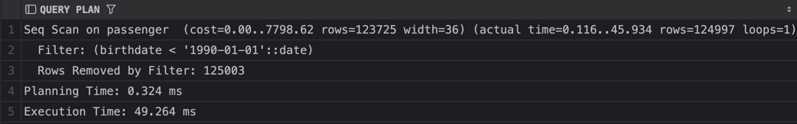

---

#### \=

```sql
EXPLAIN ANALYZE SELECT id, client_id, booking_date
FROM booking
WHERE booking_date = '2026-01-26 13:07:19.091002 +00:00';
```

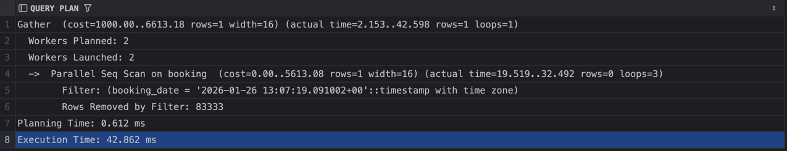

```sql
EXPLAIN (ANALYZE, BUFFERS) SELECT id, client_id, booking_date
FROM booking
WHERE booking_date = '2026-01-26 13:07:19.091002 +00:00';
```

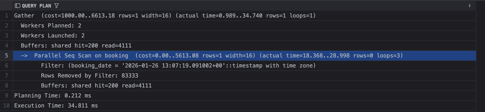

---

#### \%like

```sql
EXPLAIN ANALYZE SELECT first_name, last_name
FROM passenger
WHERE first_name LIKE 'A%';
```

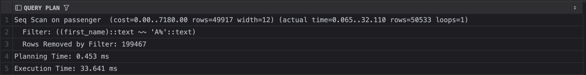

```sql
EXPLAIN (ANALYZE, BUFFERS) SELECT first_name, last_name
FROM passenger
WHERE first_name LIKE 'A%';
```

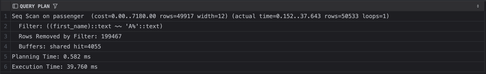

---

#### like\%

```sql
EXPLAIN ANALYZE SELECT first_name, last_name
FROM passenger
WHERE first_name LIKE '%lov';
```

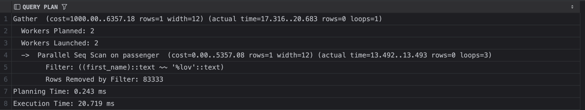

---

#### IN

```sql
EXPLAIN (ANALYZE, BUFFERS) SELECT first_name, last_name
FROM client
WHERE first_name IN ('Alex', 'Olga', 'Ivan');
```

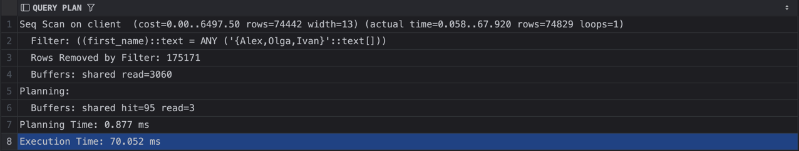

```sql
EXPLAIN ANALYZE SELECT first_name, last_name
FROM client
WHERE first_name IN ('Alex', 'Olga', 'Ivan');
```

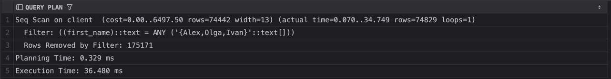

### Итог запросов без индексов

> Санирование - Seq Scan, то есть последовтаельно все считываем и проверяем. Так же если данные закешированны видно в BUFFERS shared hit
> Если же с диска видим sahred read

## Запросы c индексами

### B-tree

```sql
CREATE INDEX idx_passenger_birthdate ON passenger (birthdate);
```
---

#### \>

```sql
EXPLAIN ANALYZE SELECT first_name || ' ' || last_name as FIO, birthdate
FROM passenger
WHERE birthdate > '1990-01-01';
```

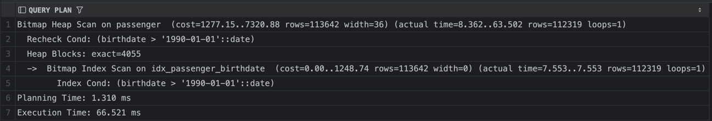

Видно, что индекс не дал особого ускорения, так как возвращается сликом много строк (112000 из 250000). То есть сэкономленное время тратиться на прохождение индекса и построения Bitmap

```sql
EXPLAIN (ANALYZE, BUFFERS) SELECT first_name || ' ' || last_name as FIO, birthdate
FROM passenger
WHERE birthdate > '1990-01-01';
```
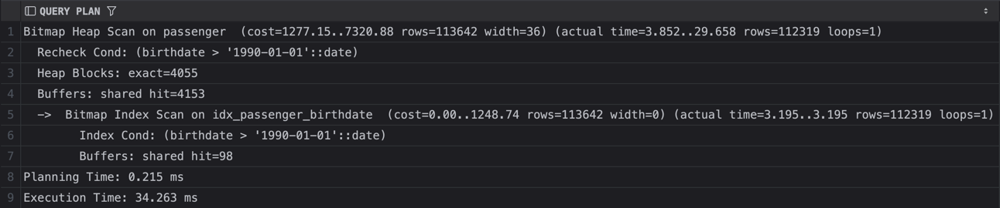

Появилось ускорение, но из-за кэширования

---

#### \<

```sql
EXPLAIN (ANALYZE, BUFFERS) SELECT first_name || ' ' || last_name as FIO, birthdate
FROM passenger
WHERE birthdate < '1982-01-01';
```

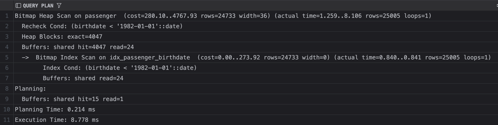

В этом примере я уменьшил дату, увеличилась селективность и индекс дал прирост скорости выполнения запроса

---

#### \=

```sql
CREATE INDEX idx_booking_date ON booking (booking_date);
```

```sql
EXPLAIN (ANALYZE, BUFFERS) SELECT id, client_id, booking_date
FROM booking
WHERE booking_date = '2026-01-26 13:07:19.091002 +00:00';
```

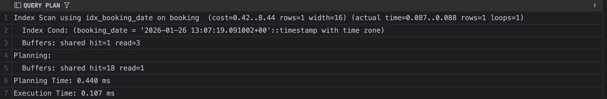

Для конкретного значения индекс дал большое ускорение (в 400 раз)

---

#### \%like

```sql
CREATE INDEX idx_passenger_first_name ON passenger (first_name text_pattern_ops);
```

```sql
EXPLAIN ANALYZE SELECT first_name, last_name
FROM passenger
WHERE first_name LIKE 'A%';
```

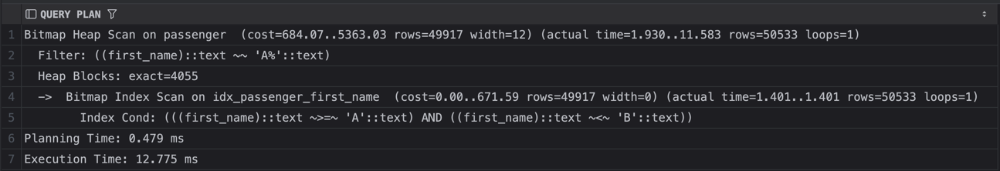

---

#### like\%

```sql
EXPLAIN ANALYZE SELECT first_name, last_name
FROM passenger
WHERE first_name LIKE '%lov';
```

Тут индекс не работает, так как суффикс, поэтому Seq Scan

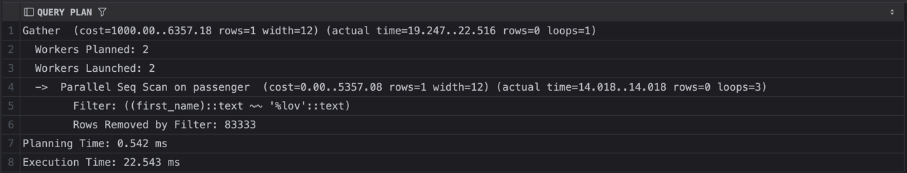

---

#### IN

```sql
CREATE INDEX idx_client_first_name ON client (first_name text_pattern_ops);
```

```sql
EXPLAIN (ANALYZE, BUFFERS) SELECT first_name, last_name
FROM client
WHERE first_name IN ('Alex', 'Olga', 'Ivan');
```


```sql
EXPLAIN ANALYZE SELECT first_name, last_name
FROM client
WHERE first_name IN ('Alex', 'Olga', 'Ivan');
```

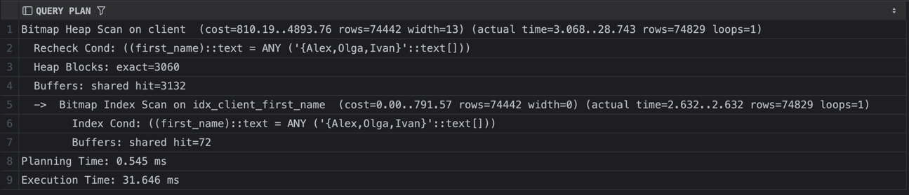

Индекс сработал, с IN он работает, внутри просто =, но строк опять слишком много возвращается, поэтому ускорения нет

### Hash

```sql
CREATE INDEX idx_passenger_birthdate ON passenger USING hash (birthdate);
```
---

#### \>

```sql
EXPLAIN ANALYZE SELECT first_name || ' ' || last_name as FIO, birthdate
FROM passenger
WHERE birthdate > '1990-01-01';
```

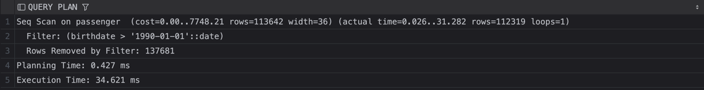

Hash index не работает с диапазонами, поэтому используется Seq scan

---

#### \<

Аналогично: Hash index не работает с диапазонами, поэтому используется Seq scan

---

```sql
CREATE INDEX idx_booking_date ON booking USING hash (booking_date);
```

#### \=

```sql
EXPLAIN (ANALYZE, BUFFERS) SELECT id, client_id, booking_date
FROM booking
WHERE booking_date = '2026-01-26 13:07:19.091002 +00:00';
```

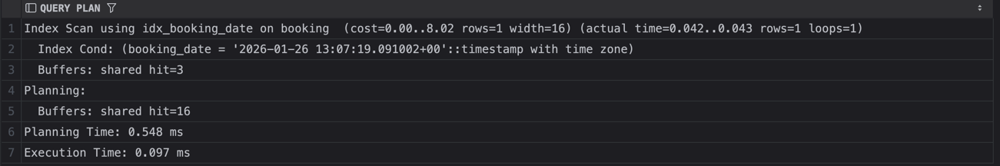

Hash как раз хорошо работает с конкретными значениями, время, почти как у B-tree, но меньше обращений в память. Так как не нужнобходить дерево индекса

---

#### \%like

```sql
CREATE INDEX idx_passenger_first_name ON passenger USING hash (first_name text_pattern_ops);
```

```sql
EXPLAIN ANALYZE SELECT first_name, last_name
FROM passenger
WHERE first_name LIKE 'A%';
```

Аналогично: Hash index не работает с Like, поэтому используется Seq scan

---

#### like\%

```sql
EXPLAIN ANALYZE SELECT first_name, last_name
FROM passenger
WHERE first_name LIKE '%lov';
```

Аналогично: Hash index не работает с Like, поэтому используется Seq scan

---

#### IN

```sql
CREATE INDEX idx_client_first_name ON client USING hash (first_name text_pattern_ops);
```

```sql
EXPLAIN (ANALYZE, BUFFERS) SELECT first_name, last_name
FROM client
WHERE first_name IN ('Alex', 'Olga', 'Ivan');
```

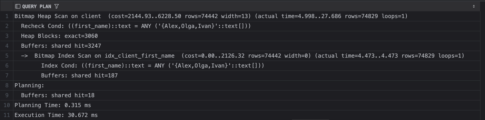

```sql
EXPLAIN ANALYZE SELECT first_name, last_name
FROM client
WHERE first_name IN ('Alex', 'Olga', 'Ivan');
```

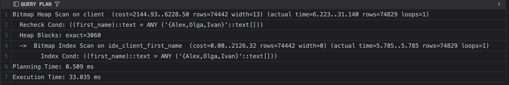

Индекс сработал, с IN он работает, внутри просто =. Время примерно такое же, как у B-tree, но меньше обращений read в память, так ка кне читаем дерево


### Составной индекс

```sql
DROP INDEX IF EXISTS idx_passenger_first_name_with_birthdate;
CREATE INDEX idx_passenger_first_name_with_birthdate ON passenger (first_name text_pattern_ops, birthdate);
```

```sql
EXPLAIN ANALYZE SELECT first_name, last_name
FROM passenger
WHERE first_name = 'Anna' AND birthdate > '1985-01-01';
```

Без индекса

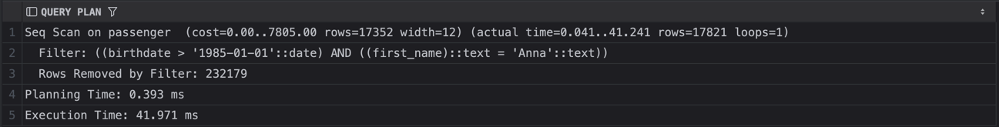

С индексом

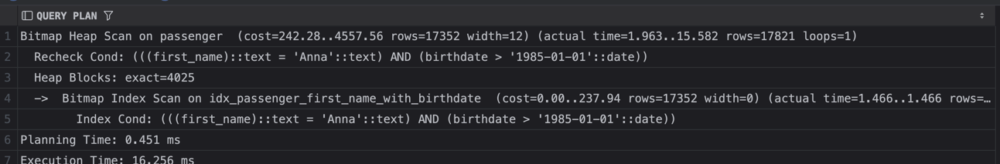

Только по второму полю

```sql
EXPLAIN ANALYZE SELECT first_name, last_name
FROM passenger
WHERE birthdate > '1985-01-01';
```

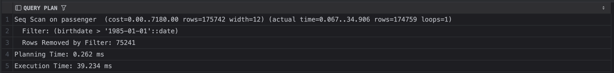

Только по первому полю

```sql
EXPLAIN ANALYZE SELECT first_name, last_name
FROM passenger
WHERE first_name = 'Anna';
```

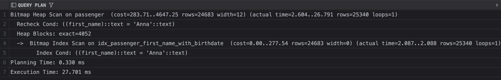
