## Индексы

### GIN

---

### 1

```sql
CREATE INDEX idx_gin_booking_contact_data
    ON booking USING GIN (contact_data);
```

```sql
EXPLAIN ANALYZE
SELECT id, contact_data
FROM booking
WHERE contact_data @> '{"email": "test@example.com"}';
```

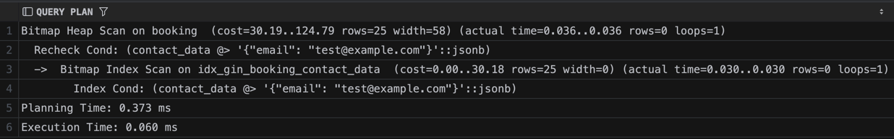

```sql
DROP INDEX IF EXISTS idx_gin_booking_contact_data;
EXPLAIN ANALYZE
SELECT id FROM booking WHERE contact_data @> '{"email": "test@example.com"}';
```

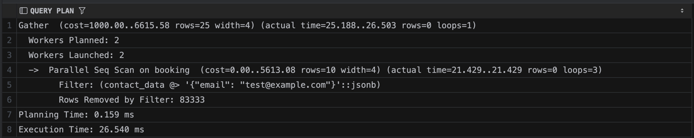

В сравнении с GIN индексом и без него видно значительное ускорение при поиске в JSONB

### 2

```sql
CREATE INDEX idx_gin_passenger_search_vector
    ON passenger USING GIN (search_vector);
```

```sql
EXPLAIN ANALYZE
SELECT id, first_name, last_name
FROM passenger
WHERE search_vector @@ to_tsquery('russian', 'Иван');
```

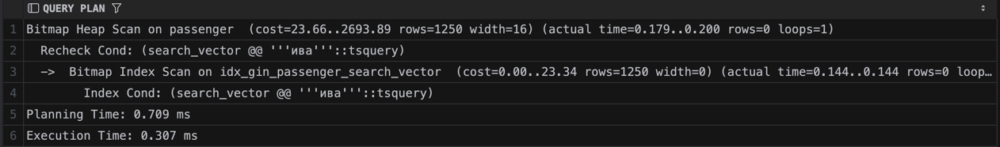

```sql
DROP INDEX IF EXISTS idx_gin_passenger_search_vector;
EXPLAIN ANALYZE
SELECT id FROM passenger WHERE search_vector @@ to_tsquery('russian', 'Иван');
```

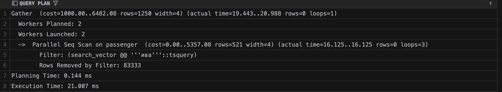

В сравнении с GIN индексом и без него видно значительное ускорение

### 3

```sql
CREATE INDEX idx_gin_passenger_tags
    ON passenger USING GIN (tags);
```

```sql
EXPLAIN ANALYZE
SELECT id, first_name, last_name, tags
FROM passenger
WHERE tags @> ARRAY['VIP'];
```

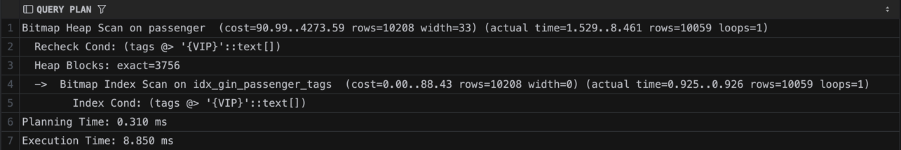

```sql
DROP INDEX IF EXISTS idx_gin_passenger_tags;
EXPLAIN ANALYZE
SELECT id FROM passenger WHERE tags @> ARRAY['VIP'];
```

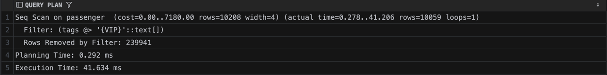

В сравнении с GIN индексом и без него видно значительное ускорение

### 4

```sql
CREATE EXTENSION IF NOT EXISTS pg_trgm;
CREATE INDEX idx_gin_booking_token
    ON booking USING GIN (CAST(booking_token AS text) gin_trgm_ops);
```

```sql
EXPLAIN ANALYZE
SELECT id FROM booking WHERE booking_token::text LIKE '%a1b2%';
```

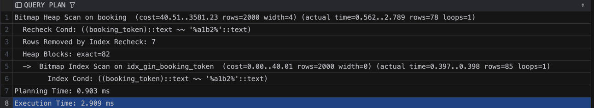

```sql
DROP INDEX IF EXISTS idx_gin_booking_token;
EXPLAIN ANALYZE
SELECT id FROM booking WHERE booking_token::text LIKE '%a1b2%';
```

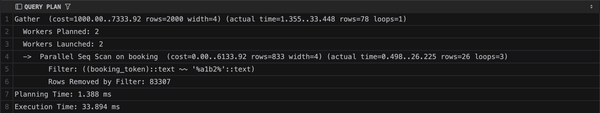

В сравнении с GIN индексом и без него видно значительное ускорение

### 5

```sql
CREATE INDEX idx_gin_passenger_tags
    ON passenger USING GIN (tags);
```

```sql
EXPLAIN ANALYZE
SELECT id, first_name, last_name, tags
FROM passenger
WHERE tags && ARRAY['VIP', 'wheelchair'];
```

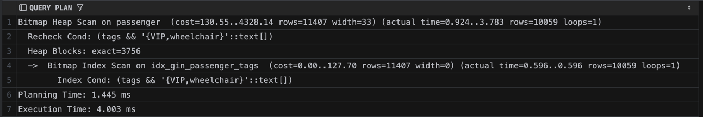

```sql
DROP INDEX IF EXISTS idx_gin_passenger_tags;
EXPLAIN ANALYZE
SELECT id FROM passenger WHERE tags && ARRAY['VIP', 'wheelchair'];
```

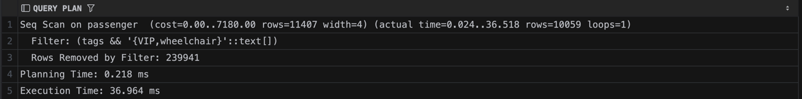

В сравнении с GIN индексом и без него видно значительное ускорение

---

### GiST

### 1

```sql
CREATE INDEX idx_gist_booking_user_location
    ON booking USING GiST (user_location);
```

```sql
EXPLAIN ANALYZE
SELECT id, user_location
FROM booking
WHERE user_location <-> POINT(37.62, 55.75) < 0.5;
```

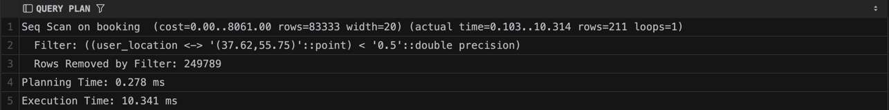

```sql
DROP INDEX IF EXISTS idx_gist_booking_user_location;
EXPLAIN ANALYZE
SELECT id FROM booking
WHERE user_location <-> POINT(37.62, 55.75) < 0.5;
```

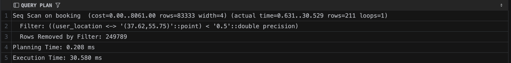

Значительное ускорение при поиске с геометрией

### 2

```sql
CREATE INDEX idx_gist_flight_time_range
    ON flight USING GiST (flight_time_range);
```

```sql
EXPLAIN ANALYZE
SELECT id, flight_number, flight_time_range
FROM flight
WHERE flight_time_range && tstzrange(
        '2024-06-01 00:00:00+03',
        '2024-06-02 00:00:00+03'
                           );
```

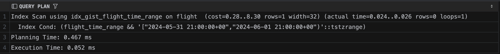

```sql
DROP INDEX IF EXISTS idx_gist_flight_time_range;
EXPLAIN ANALYZE
SELECT id FROM flight
WHERE flight_time_range && tstzrange('2024-06-01+03','2024-06-02+03');
```

Значительное ускорение при пересечении диапозонов

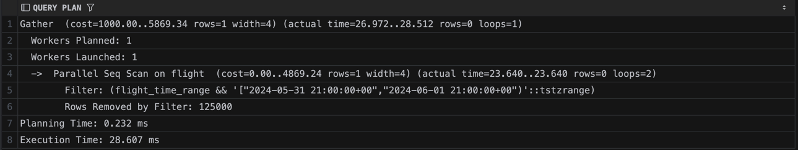

### 3

```sql
CREATE INDEX idx_gist_flight_time_range
    ON flight USING GiST (flight_time_range);
```

```sql
EXPLAIN ANALYZE
SELECT id, flight_number, flight_time_range
FROM flight
WHERE flight_time_range <@ tstzrange(
        '2024-06-01 00:00:00+03',
        '2024-12-31 23:59:59+03'
                           );
```

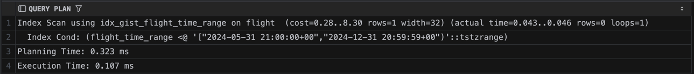

```sql
DROP INDEX IF EXISTS idx_gist_flight_time_range;
EXPLAIN ANALYZE
SELECT id, flight_number, flight_time_range
FROM flight
WHERE flight_time_range <@ tstzrange(
        '2024-06-01 00:00:00+03',
        '2024-12-31 23:59:59+03'
                           );
```

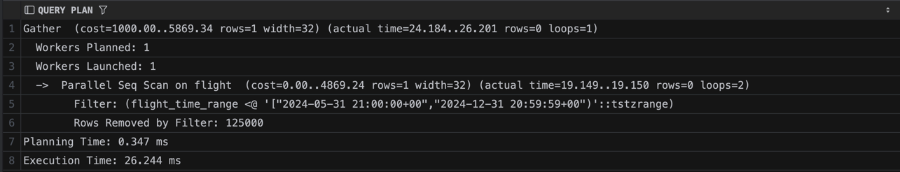

Ускорении, при точном совпадении диапазона

### 4

```sql
CREATE INDEX idx_gist_passenger_search_vector
    ON passenger USING GiST (search_vector);
```

```sql
EXPLAIN ANALYZE
SELECT id, first_name, last_name
FROM passenger
WHERE search_vector @@ to_tsquery('russian', 'Иван');
```

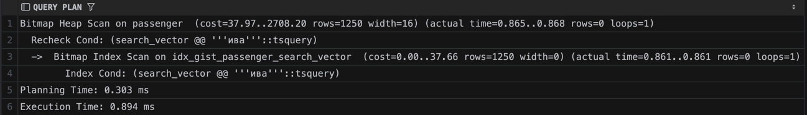

```sql
DROP INDEX IF EXISTS idx_gist_passenger_search_vector;
EXPLAIN ANALYZE
SELECT id, first_name, last_name
FROM passenger
WHERE search_vector @@ to_tsquery('russian', 'Иван');
```

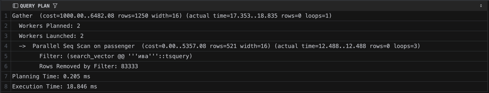

Сравнение полнотекстового поиска с GIN, медленее, но быстрее вставка будет

### 5

```sql
CREATE INDEX idx_gist_booking_location_knn
    ON booking USING GiST (user_location);
```

```sql
EXPLAIN ANALYZE
SELECT id, user_location,
       user_location <-> POINT(37.62, 55.75) AS distance
FROM booking
ORDER BY user_location <-> POINT(37.62, 55.75)
    LIMIT 10;
```

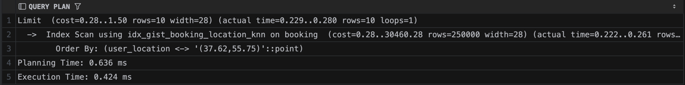

```sql
DROP INDEX IF EXISTS idx_gist_booking_location_knn;
EXPLAIN ANALYZE
SELECT id, user_location,
       user_location <-> POINT(37.62, 55.75) AS distance
FROM booking
ORDER BY user_location <-> POINT(37.62, 55.75)
    LIMIT 10;
```

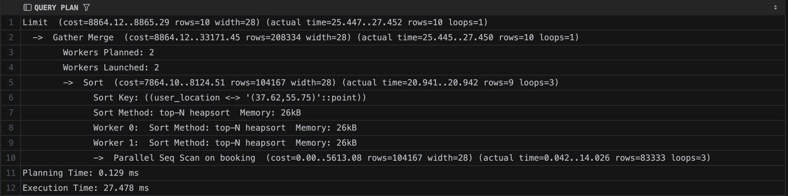

### JOIN

### 1

```sql
EXPLAIN ANALYZE
SELECT t.id        AS ticket_id,
       p.first_name,
       p.last_name,
       b.booking_date,
       b.total_cost
FROM ticket t
         JOIN passenger p ON t.passenger_id = p.id
         JOIN booking b   ON t.booking_id   = b.id;
```

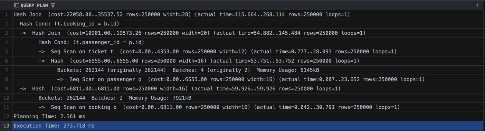

Hash Join, так как таблицы большие и условие равенства

### 2

```sql
EXPLAIN ANALYZE
SELECT c.first_name, c.last_name, b.booking_date, b.total_cost
FROM client c
         JOIN booking b ON b.client_id = c.id
    LIMIT 100;
```

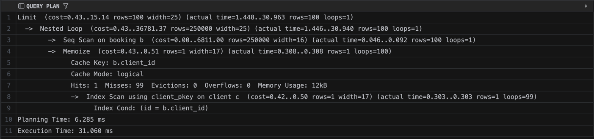

Nested из-за limit 100

### 3

```sql
EXPLAIN ANALYZE
SELECT t.seat_number, t.is_online_checkin, p.first_name, p.last_name
FROM ticket t
         JOIN passenger p ON t.passenger_id = p.id
```

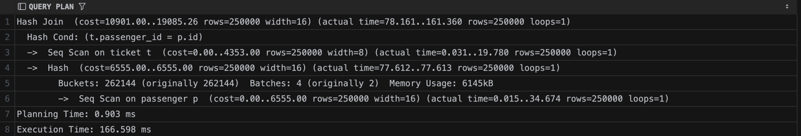

### 4

```sql
EXPLAIN ANALYZE
SELECT a.iata_code, a.name AS airport, c.name AS city
FROM airport a
         JOIN city c ON a.city_id = c.id;
```

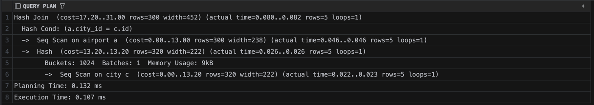

### 5

```sql
EXPLAIN ANALYZE
SELECT f.id, fn.number, f.departure_time
FROM flight f
         JOIN flight_number fn ON f.flight_number = fn.number
ORDER BY fn.number;
```

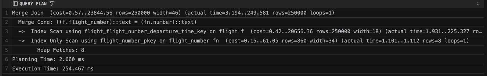

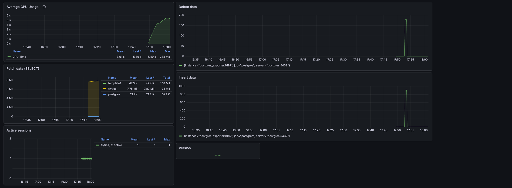