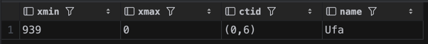
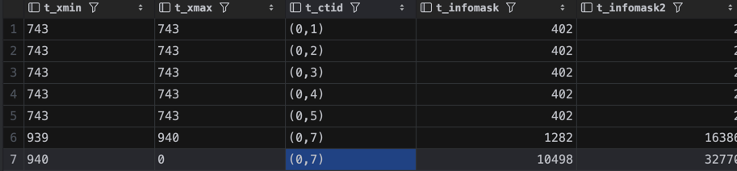
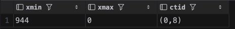
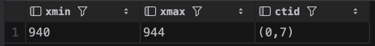
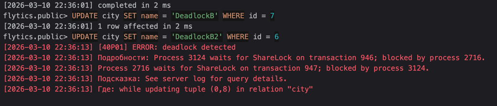
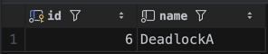
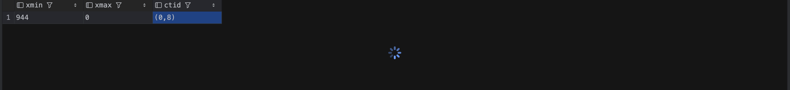
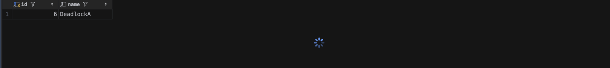
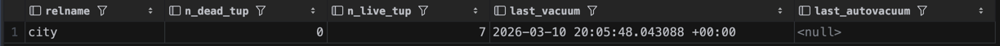

# 1 Смоделировать обновление данных и посмотреть на параметры xmin, xmax, ctid, t_infomask

```sql
INSERT INTO city (name) VALUES ('Ufa');

SELECT xmin, xmax, ctid, name FROM city WHERE name = 'Ufa';
```



xmin = 939 - id транзакции создавшей строку
xmax = 0 — никто не удалял/обновлял, строка живая

```sql
UPDATE city SET name = 'Ufa City' WHERE name = 'Ufa';

SELECT xmin, xmax, ctid, name FROM city WHERE name = 'Ufa City';
```


xmin = 940 - изменился
ctid - теперь указывает на новое значение

```sql
CREATE EXTENSION IF NOT EXISTS pageinspect;

SELECT t_xmin, t_xmax, t_ctid, t_infomask, t_infomask2
FROM heap_page_items(get_raw_page('city', 0));
```



**t_infomask**  - хранит флаги, для определения свойств текущей версии

Например: 10498 = 0x2902 = биты 0x2000 | 0x0800 | 0x0100 | 0x0002

- 0x2000	HEAP_UPDATED - это результат UPDATE, а не чистый INSERT
- 0x0800	HEAP_XMAX_INVALID	- xmax невалиден (нет удаления)
- 0x0100	HEAP_XMIN_COMMITTED	- xmin закоммичен 

# 3 Посмотреть на параметры из п1 в разных транзакциях

Сессия 1:
```sql
BEGIN;
UPDATE city SET name = 'Test' WHERE id = 6;

SELECT xmin, xmax, ctid FROM city WHERE id = 6;
```



Сессия 2:
```sql
SELECT xmin, xmax, ctid FROM city WHERE id = 6;
```



Мы все еще видим старые данные из 2 сессии, пока не закомичено из сессии 1 (но xmax уже проставлен)

Сессия 1:
```sql
COMMIT;
```

Сессия 2:
```sql
SELECT xmin, xmax, ctid FROM city WHERE id = 6;
```


После коммита из 1 сессии, вторая начинает видеть новые данные

# 4 Смоделировать дедлок, описать результаты

Сессия 1:
```sql
BEGIN;
UPDATE city SET name = 'DeadlockA' WHERE id = 6;
```
Сессия 2:
```sql
BEGIN;
UPDATE city SET name = 'DeadlockB' WHERE id = 7;
```

Сессия 1:
```sql
UPDATE city SET name = 'DeadlockA2' WHERE id = 7;
```

Сессия 2:
```sql
UPDATE city SET name = 'DeadlockB2' WHERE id = 6;
```



1. Сессия 1 обращается к строке id = 6, Сессия 2 обращается к строке с id = 7
2. Сессия 1 хочет обратится к строке id = 7 (Но ее уже изменила Ссесия 2, но еще не закомитила) ждем
3. Сессия 2 хочет обратится к строке id = 6 (Но ее уже изменила Ссесия 1, но еще не закомитила) ждем
4. ИТОГ: Deadlock

# 5 Режимы блокировки на уровне строк – написать запросы и посмотреть на конфликты в разных транзакциях

### FOR UPDATE

Сессия 1:
```sql
BEGIN;
SELECT * FROM city WHERE id = 6 FOR UPDATE;
```

Сессия 2:
```sql
BEGIN;
SELECT * FROM city WHERE id = 6 FOR UPDATE;
```

Сессия 1:



Сессия 2:



Сессия 2 в ожидании разблокировки строки


### FOR SHARE

Сессия 1:
```sql
BEGIN;
SELECT * FROM city WHERE id = 6 FOR SHARE;
```

Сессия 2:
```sql
BEGIN;
SELECT * FROM city WHERE id = 6 FOR SHARE;
```

Сессия 3:
```sql
BEGIN;
SELECT * FROM city WHERE id = 6 FOR UPDATE;
```

Нескольким транзакциям доступно чтение, но изменять нельзя



Сессия 3 зависает в ожидании


# 6 Очистка данных


```sql
SELECT relname, n_dead_tup, n_live_tup, last_vacuum, last_autovacuum
FROM pg_stat_user_tables
WHERE relname = 'city';
```


После прошлых тестов, остались мертвые строки


```sql
VACUUM city;

SELECT relname, n_dead_tup, n_live_tup, last_vacuum, last_autovacuum
FROM pg_stat_user_tables
WHERE relname = 'city';
```



Не используемые строки очистились