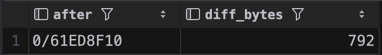
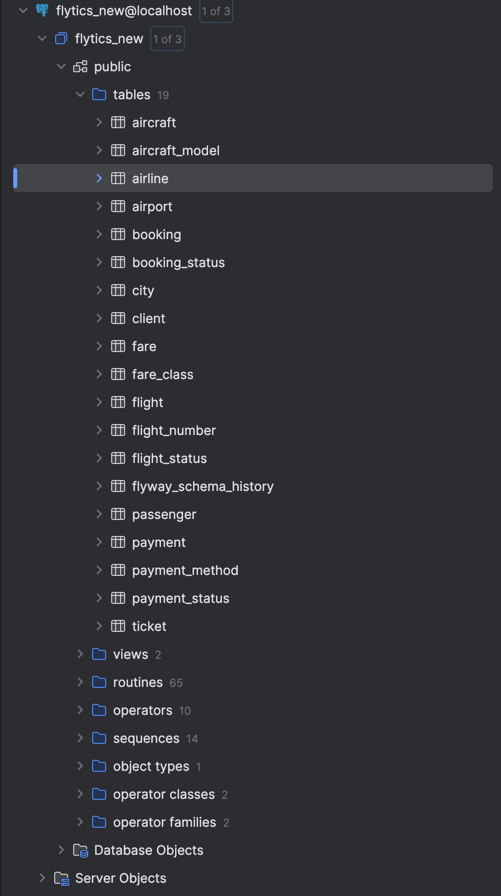

# 2 Посмотреть на изменение LSN и WAL после изменения данных

#### INSERT (a)

```sql
SELECT pg_current_wal_lsn() AS lsn_before;

INSERT INTO city (name) VALUES ('Test City');

SELECT pg_current_wal_lsn() AS lsn_after;
```


После вставки данных




#### COMMIT (b)


```sql
BEGIN;

SELECT pg_current_wal_lsn() AS lsn_before_commit;

INSERT INTO city (name) VALUES ('WAL Test Before Commit');


SELECT pg_current_wal_lsn() AS lsn_after_insert_but_before_commit;

COMMIT;

SELECT pg_current_wal_lsn() AS lsn_after_commit;
```


На скриншоте видно, что сам INSERT уже растет LSN, а после коммита он вырос еще на чуть чуть, так как запись коммита занчимает меньше, чем запись о вставке


#### Анализ после массовой операции (c)

```sql
SELECT pg_current_wal_lsn() AS lsn_before;

INSERT INTO city (name)
SELECT 'City ' || i
FROM generate_series(1, 10000) AS s(i);

SELECT
    pg_current_wal_lsn() AS lsn_after,
    pg_size_pretty(
            pg_wal_lsn_diff(
                    pg_current_wal_lsn(),
                    '0/628E33F8'
            )
    ) AS wal_generated;
```


# 3 Сделать дамп БД и накатить его на новую чистую БД

```bash
docker exec -it s2-postgres-1 bash

pg_dump -U postgres -d flytics --schema-only -f /tmp/flytics_schema.sql

pg_dump -U postgres -d flytics -t passenger -f /tmp/passenger_dump.sql

psql -U postgres -c "CREATE DATABASE flytics_new;"

psql -U postgres -d flytics_new -f /tmp/flytics_schema.sql
psql -U postgres -d flytics_new -f /tmp/passenger_dump.sql
```

Создаем дамп для схемы и для таблицы passenger

дампы лежат в папке dumps



# 4 Создать несколько seed

Создал файл seed1.sql

```sql
INSERT INTO passenger (first_name, last_name, birthdate, passport_series, passport_number)
VALUES
    ('Ivan',  'Petrov',  '1990-05-15', '1234', '567890'),
    ('Maria', 'Ivanova', '1985-11-20', '2345', '678901')
    ON CONFLICT (passport_series, passport_number) DO NOTHING;

INSERT INTO client (first_name, last_name, email, password_hash)
VALUES
    ('Ivan', 'Petrov', 'ivan@example.com', 'new_hash_ivan')
    ON CONFLICT (email) DO UPDATE
                               SET first_name   = EXCLUDED.first_name,
                               last_name    = EXCLUDED.last_name,
                               password_hash = EXCLUDED.password_hash;

INSERT INTO fare_class (description)
VALUES ('Economy'), ('Business'), ('First')
    ON CONFLICT (description) DO NOTHING;

INSERT INTO flight_status (description)
VALUES ('On time'), ('Delayed'), ('Landed'), ('Cancelled')
    ON CONFLICT (description) DO NOTHING;
```


```bash
docker cp seeds/seed1.sql s2-postgres-1:/tmp/seed.sql
```

Закинул seed1.sql файлик в контейнер


```bash
docker exec -it s2-postgres-1 bash

psql -U postgres -d flytics_new -f /tmp/seed.sql
```

Запускаем, данные вставились

```bash
root@864f8c9e850e:/# psql -U postgres -d flytics_new -f /tmp/seed.sql
INSERT 0 2
INSERT 0 1
INSERT 0 3
INSERT 0 4
```

Повторный запуск ошибок нет

```bash
psql -U postgres -d flytics_new -f /tmp/seed.sql
INSERT 0 0
INSERT 0 1
INSERT 0 0
INSERT 0 0
```

