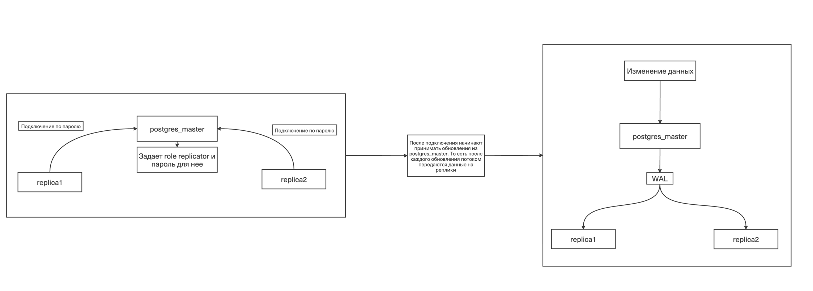
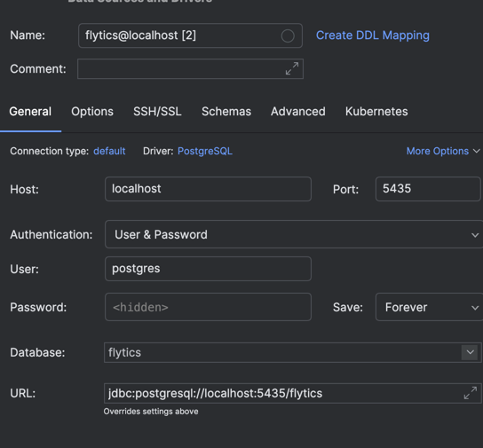
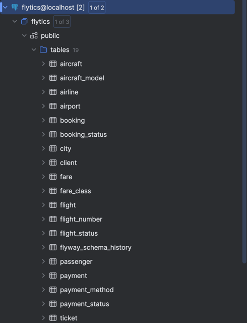
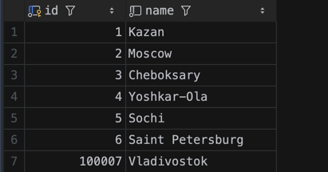
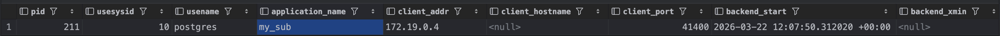
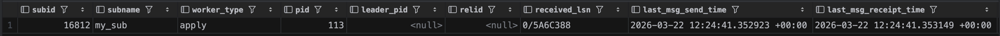

# Архитектура



# Настроить потоковую репликацию

Настройка ведущего узла и реплик

```bash
#!/bin/bash
set -e

psql -U "$POSTGRES_USER" -c "CREATE ROLE replicator WITH REPLICATION LOGIN PASSWORD 'pass';"

echo "host replication replicator 0.0.0.0/0 md5" >> "$PGDATA/pg_hba.conf"

pg_ctl reload -D "$PGDATA"
```

```bash
#!/bin/bash
set -e

echo "Waiting for master..."
until pg_isready -h postgres-master -p 5432 -U postgres; do
  sleep 2
done

rm -rf "$PGDATA"/*

PGPASSWORD=pass pg_basebackup \
  -h postgres-master \
  -D "$PGDATA" \
  -U replicator \
  -P \
  -R

exec docker-entrypoint.sh postgres
```

Поднятие реплик и инициализация

```yml
  postgres-master:
    image: postgres:17
    environment:
      POSTGRES_DB: flytics
      POSTGRES_USER: postgres
      POSTGRES_PASSWORD: qwerty007
    ports:
      - "5432:5432"
    command: >
      postgres
      -c shared_preload_libraries=pg_stat_statements
      -c pg_stat_statements.track=all
      -c wal_level=replica
      -c max_wal_senders=10
      -c max_replication_slots=10
      -c listen_addresses=*
    volumes:
      - master_data:/var/lib/postgresql/data
      - ./replication/master-init.sh:/docker-entrypoint-initdb.d/master-init.sh

  postgres-replica1:
    image: postgres:17
    environment:
      POSTGRES_PASSWORD: qwerty007
      PGDATA: /var/lib/postgresql/data
    ports:
      - "5433:5432"
    entrypoint: [ "/bin/bash", "/replication/replica-init.sh" ]
    volumes:
      - replica1_data:/var/lib/postgresql/data
      - ./replication/replica-init.sh:/replication/replica-init.sh
    depends_on:
      - postgres-master
```

```bash
egorsorokin@MacBook-Air-9 s2 % docker exec -it s2-postgres-master-1 \ 
  psql -U postgres -c "SELECT client_addr, state, sync_state FROM pg_stat_replication;"
 client_addr |   state   | sync_state 
-------------+-----------+------------
 172.19.0.6  | streaming | async
 172.19.0.4  | streaming | async
(2 rows)
```

2 реплики подключились

## Проверка репликации данных

```bash
egorsorokin@MacBook-Air-9 s2 % docker exec -it s2-postgres-master-1 \
> psql -U postgres -d flytics  -c "INSERT INTO city (name) VALUES ('Saint Petersburg');"
INSERT 0 1

egorsorokin@MacBook-Air-9 s2 % docker exec -it s2-postgres-replica1-1 \
  psql -U postgres -d flytics -c "SELECT * FROM city;"
 id |       name       
----+------------------
  1 | Kazan
  2 | Moscow
  3 | Cheboksary
  4 | Yoshkar-Ola
  5 | Sochi
  6 | Saint Petersburg
(6 rows)

egorsorokin@MacBook-Air-9 s2 % docker exec -it s2-postgres-replica2-1 \
  psql -U postgres -d flytics -c "SELECT * FROM city;"
 id |       name       
----+------------------
  1 | Kazan
  2 | Moscow
  3 | Cheboksary
  4 | Yoshkar-Ola
  5 | Sochi
  6 | Saint Petersburg
(6 rows)
```

Данные появились на репликах

```bash
egorsorokin@MacBook-Air-9 s2 % docker exec -it s2-postgres-replica1-1 \
  psql -U postgres -d flytics -c "INSERT INTO city (name) VALUES ('Novosibirsk');"
ERROR:  cannot execute INSERT in a read-only transaction
```

Вставить данные в реплику не удалось, так как изменение только через WAL ведущего узла


## Анализ replication lag

```bash
egorsorokin@MacBook-Air-9 s2 % while true; do
  docker exec s2-postgres-master-1 \
    psql -U postgres -c "
      SELECT client_addr, write_lag, flush_lag, replay_lag
      FROM pg_stat_replication;"
  sleep 1
done

egorsorokin@MacBook-Air-9 s2 % docker exec -it s2-postgres-master-1 \
  psql -U postgres -d flytics -c "
    INSERT INTO city (name)
    SELECT 'City_' || generate_series(1, 100000);"
INSERT 0 100000


#Вывод цикла

 client_addr | write_lag | flush_lag | replay_lag 
-------------+-----------+-----------+------------
 172.19.0.6  |           |           | 
 172.19.0.4  |           |           | 
(2 rows)

 client_addr |    write_lag    |    flush_lag    |   replay_lag    
-------------+-----------------+-----------------+-----------------
 172.19.0.6  | 00:00:00.008215 | 00:00:00.014234 | 00:00:00.047422
 172.19.0.4  | 00:00:00.008915 | 00:00:00.014139 | 00:00:00.043753
(2 rows)

 client_addr |    write_lag    |    flush_lag    |   replay_lag    
-------------+-----------------+-----------------+-----------------
 172.19.0.6  | 00:00:00.008215 | 00:00:00.014234 | 00:00:00.047422
 172.19.0.4  | 00:00:00.008915 | 00:00:00.014139 | 00:00:00.043753
(2 rows)
```

Пояснение:

**write_lag** - время когда мастер записал и отправил на реплику

**flush_lag** - время когда реплика считала WAL и реально записала на диск

**replay_lag**  - время, когда реплика реально записала данные на диск

---

# Logical replication

```yml
  postgres-master:
    image: postgres:17
    environment:
      POSTGRES_DB: flytics
      POSTGRES_USER: postgres
      POSTGRES_PASSWORD: qwerty007
    ports:
      - "5432:5432"
    command: >
      postgres
      -c shared_preload_libraries=pg_stat_statements
      -c pg_stat_statements.track=all
      -c wal_level=logical
      -c max_wal_senders=10
      -c max_replication_slots=10
      -c listen_addresses=*
    volumes:
      - master_data:/var/lib/postgresql/data
      - ./replication/master-init.sh:/docker-entrypoint-initdb.d/master-init.sh

postgres-subscriber:
  image: postgres:17
  environment:
    POSTGRES_DB: flytics
    POSTGRES_USER: postgres
    POSTGRES_PASSWORD: qwerty007
  ports:
    - "5435:5432"
  volumes:
    - subscriber_data:/var/lib/postgresql/data
  depends_on:
    postgres-master:
      condition: service_healthy
```

Запустили докер

### Как могут пригодится pg_dump/pg_restore для данного вида репликации

Так как схема бд не реплицируется pg_dump полезен, так как на подписчика можно легко перенести схему, анологичную ведомоу узлу

```bash
egorsorokin@MacBook-Air-9 s2 % cat dumps/flytics_schema.sql | docker exec -i s2-postgres-subscriber-1 \
  psql -U postgres -d flytics
```

Накатываем dump схемы на subscriber






Создание PUBLICATION на стороне postgres_master

```sql
CREATE PUBLICATION my_pub
    FOR TABLE city, airport, airline;
```


Создание SUBSCRIPTION на стороне postgres-subscriber

```sql
CREATE SUBSCRIPTION my_sub
    CONNECTION 'host=postgres-master port=5432 dbname=flytics user=postgres password=qwerty007'
    PUBLICATION my_pub;
```


на стороне postgres_master

```sql
INSERT INTO city (name) VALUES ('Vladivostok');
```

Данные появляются на postgres-subscriber (реплицируются)

```bash
egorsorokin@MacBook-Air-9 s2 % docker exec -it s2-postgres-subscriber-1 \
  psql -U postgres -d flytics -c "SELECT * FROM city;"
   id   |       name       
--------+------------------
      1 | Kazan
      2 | Moscow
      3 | Cheboksary
      4 | Yoshkar-Ola
      5 | Sochi
      6 | Saint Petersburg
 100007 | Vladivostok
(7 rows)
```

### DDL

на стороне postgres_master

```sql
ALTER TABLE city ADD COLUMN population INT;
```



Не появилась на стороне postgres-subscriber

### REPLICA IDENTITY

```bash
egorsorokin@MacBook-Air-9 s2 % docker exec -it s2-postgres-master-1 \
  psql -U postgres -d flytics -c "
    CREATE TABLE test_no_pk (
      name VARCHAR(100),
      value INT
    );"
CREATE TABLE

egorsorokin@MacBook-Air-9 s2 % docker exec -it s2-postgres-subscriber-1 \
  psql -U postgres -d flytics -c "
    CREATE TABLE test_no_pk (
      name VARCHAR(100),
      value INT
    );"
CREATE TABLE

egorsorokin@MacBook-Air-9 s2 % docker exec -it s2-postgres-master-1 \
  psql -U postgres -d flytics -c "
    ALTER PUBLICATION my_pub ADD TABLE test_no_pk;"
ALTER PUBLICATION
```

Создаем таблицу без PK (на стороне postgres-master и postgres-subscriber) и добавляем в PUBLICATION

```bash
egorsorokin@MacBook-Air-9 s2 % docker exec -it s2-postgres-master-1 \
  psql -U postgres -d flytics -c "
    INSERT INTO test_no_pk VALUES ('test', 1);
    UPDATE test_no_pk SET value = 2 WHERE name = 'test';"
INSERT 0 1
ERROR:  cannot update table "test_no_pk" because it does not have a replica identity and publishes updates
HINT:  To enable updating the table, set REPLICA IDENTITY using ALTER TABLE.
```
Получили ошибку при update, так как требуется PK для обновления строки, а его в таблице нет


### Replication status

```sql
SELECT * FROM pg_stat_replication;
```
postgres-master


---

```sql
SELECT * FROM pg_stat_subscription;
```
postgres-subscriber
