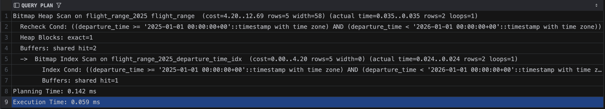
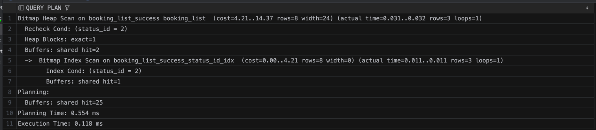
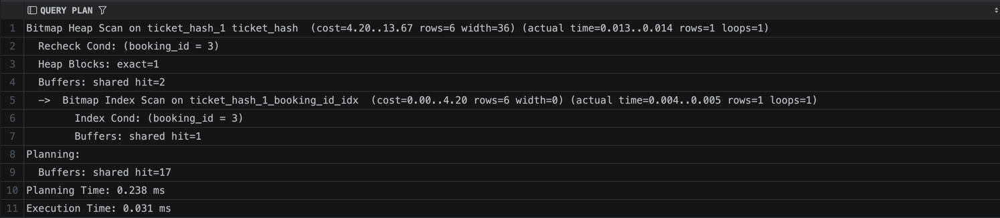
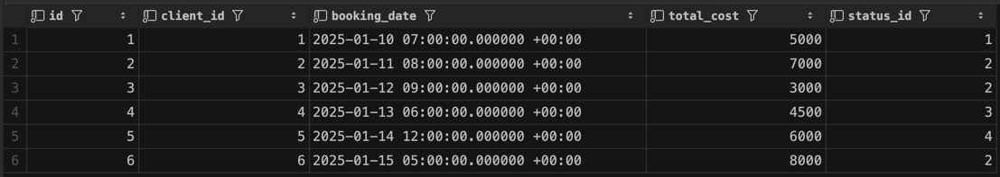
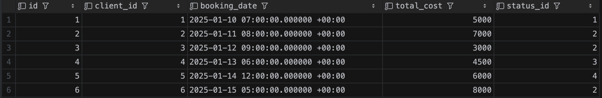
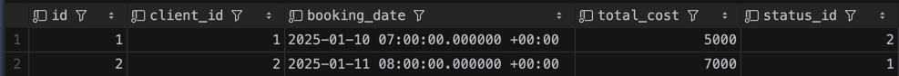
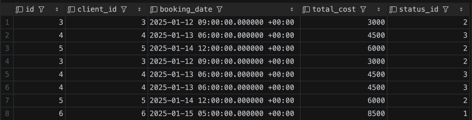
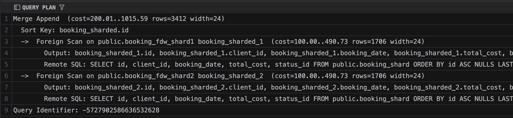
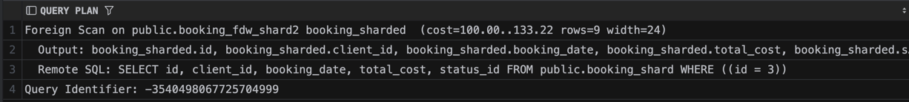

## Секционирование: RANGE / LIST / HASH.

#### RANGE

```sql
DROP TABLE IF EXISTS flight_range CASCADE;

CREATE TABLE flight_range
(
    id             SERIAL,
    flight_number  VARCHAR(8)  NOT NULL,
    departure_time TIMESTAMPTZ NOT NULL,
    arrival_time   TIMESTAMPTZ NOT NULL,
    status_id      INT         NOT NULL
) PARTITION BY RANGE (departure_time);

CREATE TABLE flight_range_2024 PARTITION OF flight_range
    FOR VALUES FROM ('2024-01-01 00:00:00+00') TO ('2025-01-01 00:00:00+00');

CREATE TABLE flight_range_2025 PARTITION OF flight_range
    FOR VALUES FROM ('2025-01-01 00:00:00+00') TO ('2026-01-01 00:00:00+00');

CREATE TABLE flight_range_2026 PARTITION OF flight_range
    FOR VALUES FROM ('2026-01-01 00:00:00+00') TO ('2027-01-01 00:00:00+00');

CREATE INDEX idx_flight_range_dep ON flight_range (departure_time);

INSERT INTO flight_range (flight_number, departure_time, arrival_time, status_id)
VALUES ('SU100', '2024-05-10 10:00+03', '2024-05-10 12:30+03', 3),
       ('SU101', '2024-11-20 08:00+03', '2024-11-20 10:00+03', 3),
       ('DP200', '2025-03-15 14:00+03', '2025-03-15 17:30+03', 1),
       ('DP201', '2025-09-01 06:00+03', '2025-09-01 09:00+03', 1),
       ('S7300', '2026-02-10 11:00+03', '2026-02-10 13:00+03', 1);

EXPLAIN (ANALYZE, BUFFERS)
SELECT *
FROM flight_range
WHERE departure_time >= '2025-01-01'
  AND departure_time <  '2026-01-01';
```



Видно, что обратились только в секцию 2025 и при этом был применен индекс на departure_time


### LIST

```sql
DROP TABLE IF EXISTS booking_list CASCADE;

CREATE TABLE booking_list
(
    id           SERIAL,
    client_id    INT         NOT NULL,
    booking_date TIMESTAMPTZ NOT NULL,
    total_cost   INT         NOT NULL,
    status_id    INT         NOT NULL
) PARTITION BY LIST (status_id);

CREATE TABLE booking_list_processing PARTITION OF booking_list FOR VALUES IN (1);
CREATE TABLE booking_list_success PARTITION OF booking_list FOR VALUES IN (2);
CREATE TABLE booking_list_failed PARTITION OF booking_list FOR VALUES IN (3);
CREATE TABLE booking_list_cancelled PARTITION OF booking_list FOR VALUES IN (4);


CREATE INDEX idx_booking_list_status ON booking_list (status_id);


INSERT INTO booking_list (client_id, booking_date, total_cost, status_id)
VALUES (1, '2025-01-10 10:00+03', 5000, 1),
       (2, '2025-01-11 11:00+03', 7000, 2),
       (3, '2025-01-12 12:00+03', 3000, 2),
       (4, '2025-01-13 09:00+03', 4500, 3),
       (5, '2025-01-14 15:00+03', 6000, 4),
       (6, '2025-01-15 08:00+03', 8000, 2);


EXPLAIN (ANALYZE, BUFFERS)
SELECT *
FROM booking_list
WHERE status_id = 2;
```



Обратились только в секцию со статусом success и был использован индекс

### HASH

```sql
DROP TABLE IF EXISTS ticket_hash CASCADE;

CREATE TABLE ticket_hash
(
    id           SERIAL,
    seat_number  VARCHAR(4) NOT NULL,
    booking_id   INT        NOT NULL,
    passenger_id INT        NOT NULL,
    flight_id    INT        NOT NULL
) PARTITION BY HASH (booking_id);


CREATE TABLE ticket_hash_0 PARTITION OF ticket_hash FOR VALUES WITH (MODULUS 4, REMAINDER 0);
CREATE TABLE ticket_hash_1 PARTITION OF ticket_hash FOR VALUES WITH (MODULUS 4, REMAINDER 1);
CREATE TABLE ticket_hash_2 PARTITION OF ticket_hash FOR VALUES WITH (MODULUS 4, REMAINDER 2);
CREATE TABLE ticket_hash_3 PARTITION OF ticket_hash FOR VALUES WITH (MODULUS 4, REMAINDER 3);


CREATE INDEX idx_ticket_hash_booking ON ticket_hash (booking_id);


INSERT INTO ticket_hash (seat_number, booking_id, passenger_id, flight_id)
VALUES ('1A', 1, 1, 1),
       ('2B', 2, 2, 1),
       ('3C', 3, 3, 2),
       ('4D', 4, 4, 2),
       ('5E', 5, 5, 3),
       ('6F', 6, 6, 3),
       ('7A', 7, 7, 4),
       ('8B', 8, 8, 4);


EXPLAIN (ANALYZE, BUFFERS)
SELECT *
FROM ticket_hash
WHERE booking_id = 3;
```



Оратились только в секцию ticket_hash и был использован индекс на booking_id

## 2. Секционирование и физическая репликация

Запущены физические реплики из прошлой дз replica1 и replica2

```sql
SELECT  
parent.relname AS parent_table,  
child.relname AS partition,  
pg_get_expr(child.relpartbound, child.oid) AS partition_constraint  
FROM pg_inherits i  
JOIN pg_class parent ON parent.oid = i.inhparent  
JOIN pg_class child ON child.oid = i.inhrelid  
WHERE parent.relname IN ('flight_range', 'booking_list', 'ticket_hash')  
ORDER BY parent.relname, child.relname;
```

запрос для получение информации о секциях

```bash
 parent_table |        partition        |                           partition_constraint                           
--------------+-------------------------+--------------------------------------------------------------------------
 booking_list | booking_list_cancelled  | FOR VALUES IN (4)
 booking_list | booking_list_failed     | FOR VALUES IN (3)
 booking_list | booking_list_processing | FOR VALUES IN (1)
 booking_list | booking_list_success    | FOR VALUES IN (2)
 flight_range | flight_range_2024       | FOR VALUES FROM ('2024-01-01 00:00:00+00') TO ('2025-01-01 00:00:00+00')
 flight_range | flight_range_2025       | FOR VALUES FROM ('2025-01-01 00:00:00+00') TO ('2026-01-01 00:00:00+00')
 flight_range | flight_range_2026       | FOR VALUES FROM ('2026-01-01 00:00:00+00') TO ('2027-01-01 00:00:00+00')
 ticket_hash  | ticket_hash_0           | FOR VALUES WITH (modulus 4, remainder 0)
 ticket_hash  | ticket_hash_1           | FOR VALUES WITH (modulus 4, remainder 1)
 ticket_hash  | ticket_hash_2           | FOR VALUES WITH (modulus 4, remainder 2)
 ticket_hash  | ticket_hash_3           | FOR VALUES WITH (modulus 4, remainder 3)
(11 rows)
```

Вывод на репликах

Физическая репликация не знает про секции, так как она просто принимает транслируемые изменения из WAL родителя. Мы не можем отдельно вставлять данные в реплие или самостоятельно управлять секциями на реплике. То есть тупо повторяем за мастером, нет гибкости


## Логическая репликация и секционирование publish_via_partition_root = on / off

```sql
DROP TABLE IF EXISTS booking_list CASCADE;

CREATE TABLE booking_list (
    id           SERIAL,
    client_id    INT         NOT NULL,
    booking_date TIMESTAMPTZ NOT NULL,
    total_cost   INT         NOT NULL,
    status_id    INT         NOT NULL
) PARTITION BY LIST (status_id);
CREATE TABLE booking_list_processing PARTITION OF booking_list FOR VALUES IN (1);
CREATE TABLE booking_list_success    PARTITION OF booking_list FOR VALUES IN (2);
CREATE TABLE booking_list_failed     PARTITION OF booking_list FOR VALUES IN (3);
CREATE TABLE booking_list_cancelled  PARTITION OF booking_list FOR VALUES IN (4);
```

Создаем на подпищике схему, так как DDL не реплицируется


на master
```sql
DROP PUBLICATION IF EXISTS pub_booking_default;

CREATE PUBLICATION pub_booking_default
    FOR TABLE booking_list
    WITH (publish_via_partition_root = false);
```


на subscriber
```sql
DROP SUBSCRIPTION IF EXISTS sub_booking_default;

CREATE SUBSCRIPTION sub_booking_default
    CONNECTION 'host=postgres-master port=5432 dbname=flytics user=postgres password=qwerty007'
    PUBLICATION pub_booking_default;
```



Данные появились на реплике

То есть была вставка в конкретные секции (при этом схема секций мы продублировали сами)


---
Создали схему на подпищике без секционирования
```sql
DROP TABLE IF EXISTS booking_list CASCADE;
CREATE TABLE booking_list (
    id           SERIAL,
    client_id    INT         NOT NULL,
    booking_date TIMESTAMPTZ NOT NULL,
    total_cost   INT         NOT NULL,
    status_id    INT         NOT NULL
);
```

на мастере
```sql
DROP PUBLICATION IF EXISTS pub_booking_on;

CREATE PUBLICATION pub_booking_on
    FOR TABLE booking_list
    WITH (publish_via_partition_root = true);
```

на подпищике
```sql
DROP SUBSCRIPTION IF EXISTS sub_booking_on;

CREATE SUBSCRIPTION sub_booking_on
    CONNECTION 'host=postgres-master port=5432 dbname=flytics user=postgres password=qwerty007'
    PUBLICATION pub_booking_on;
```



Данные появились, вставка была в общую таблицу (подипищик ничего не знает о секциях). Стркуктура подписщика может быть любой

## Шардирование через postgres_fdw

```yaml
  postgres-shard1:
    image: postgres:17
    environment:
      POSTGRES_DB: shard1
      POSTGRES_USER: postgres
      POSTGRES_PASSWORD: qwerty007
    ports:
      - "5436:5432"
    volumes:
      - shard1_data:/var/lib/postgresql/data

  postgres-shard2:
    image: postgres:17
    environment:
      POSTGRES_DB: shard2
      POSTGRES_USER: postgres
      POSTGRES_PASSWORD: qwerty007
    ports:
      - "5437:5432"
    volumes:
      - shard2_data:/var/lib/postgresql/data
```

Поднимаем 2 шарда в docker

```bash
egorsorokin@MacBook-Air-9 s2 % docker exec -it  s2-postgres-shard1-1 psql -U postgres -d shard1 -c "CREATE TABLE booking_shard  
(
    id           INT         NOT NULL,
    client_id    INT         NOT NULL,
    booking_date TIMESTAMPTZ NOT NULL,
    total_cost   INT         NOT NULL,
    status_id    INT         NOT NULL
);"
CREATE TABLE

egorsorokin@MacBook-Air-9 s2 % docker exec -it  s2-postgres-shard2-1 psql -U postgres -d shard2 -c "CREATE TABLE booking_shard  
(
    id           INT         NOT NULL,
    client_id    INT         NOT NULL,
    booking_date TIMESTAMPTZ NOT NULL,
    total_cost   INT         NOT NULL,
    status_id    INT         NOT NULL
);"
CREATE TABLE
```

Создаем таблицы на 1 и 2 шарде


на мастере
```sql
CREATE EXTENSION IF NOT EXISTS postgres_fdw;


CREATE SERVER shard1
    FOREIGN DATA WRAPPER postgres_fdw
    OPTIONS (host 'postgres-shard1', port '5432', dbname 'shard1');

CREATE SERVER shard2
    FOREIGN DATA WRAPPER postgres_fdw
    OPTIONS (host 'postgres-shard2', port '5432', dbname 'shard2');


CREATE USER MAPPING FOR postgres
    SERVER shard1 OPTIONS (user 'postgres', password 'qwerty007');

CREATE USER MAPPING FOR postgres
    SERVER shard2 OPTIONS (user 'postgres', password 'qwerty007');
```

Подключаем расширение, регистрируем удаленные серверсы и мапим пользователей

на мастере
```sql
CREATE FOREIGN TABLE booking_fdw_shard1 (
    id           INT          NOT NULL,
    client_id    INT          NOT NULL,
    booking_date TIMESTAMPTZ  NOT NULL,
    total_cost   INT          NOT NULL,
    status_id    INT          NOT NULL
    ) SERVER shard1 OPTIONS (table_name 'booking_shard');

CREATE FOREIGN TABLE booking_fdw_shard2 (
    id           INT          NOT NULL,
    client_id    INT          NOT NULL,
    booking_date TIMESTAMPTZ  NOT NULL,
    total_cost   INT          NOT NULL,
    status_id    INT          NOT NULL
    ) SERVER shard2 OPTIONS (table_name 'booking_shard');
```

Создаем удаленные таблицы в роутере, которые будут ссылаться на настоящие таблицы в шардах

на мастере
```sql
CREATE TABLE booking_sharded
(
    id           INT         NOT NULL,
    client_id    INT         NOT NULL,
    booking_date TIMESTAMPTZ NOT NULL,
    total_cost   INT         NOT NULL,
    status_id    INT         NOT NULL
) PARTITION BY HASH (id);

ALTER TABLE booking_sharded
    ATTACH PARTITION booking_fdw_shard1 FOR VALUES WITH (MODULUS 2, REMAINDER 0);

ALTER TABLE booking_sharded
    ATTACH PARTITION booking_fdw_shard2 FOR VALUES WITH (MODULUS 2, REMAINDER 1);
```

Создаем общую таблицу и привязываем к ней внешние таблицы из шародов

на мастере
```sql
INSERT INTO booking_sharded VALUES (1, 1, '2025-01-10 10:00+03', 5000, 2);
INSERT INTO booking_sharded VALUES (2, 2, '2025-01-11 11:00+03', 7000, 1);
INSERT INTO booking_sharded VALUES (3, 3, '2025-01-12 12:00+03', 3000, 2);
INSERT INTO booking_sharded VALUES (4, 4, '2025-01-13 09:00+03', 4500, 3);
INSERT INTO booking_sharded VALUES (5, 5, '2025-01-14 15:00+03', 6000, 2);
INSERT INTO booking_sharded VALUES (6, 6, '2025-01-15 08:00+03', 8500, 1);

SELECT * FROM booking_fdw_shard1 ORDER BY id;
SELECT * FROM booking_fdw_shard2 ORDER BY id;
```

Вставили данные и смотрим, как распредилились

shard1


shard2



Запрос на все данные
```sql
EXPLAIN (VERBOSE)
SELECT * FROM booking_sharded ORDER BY id;
```



Из плана видно, что идем в оба шарда


Запрос на один шард
```sql
EXPLAIN (VERBOSE)
SELECT * FROM booking_sharded WHERE id = 3;
```



Из плана видно, что идем в один шард